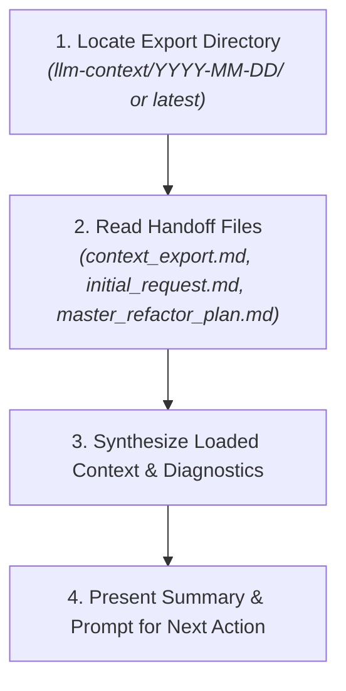

# Context Loader Skill (`context-loader`)

This skill seamlessly restores state in a fresh chat window by loading and analyzing an exported context package stored in `llm-context/<YYYY-MM-DD>/`.

---

## 1. Trigger Specification

- **Manual Launch Command:** `@context-loader` or `run skill context-loader`
- **Activation Keywords:** `load context`, `restore context`, `import context`, `load chat session`, `resume context`, `load session`, `import session`

---

## 2. Discovery & Loading Workflow

When activated, execute these 4 steps:

### Step 1: Locate Target Handoff Directory
1. Look for `<REPO_ROOT>/llm-context/`.
2. If a specific date is requested by the user, select `llm-context/<DATE>/`. Otherwise, select the latest dated folder (e.g. `2026-08-12`).

### Step 2: Read Handoff Package Files
Inspect all 3 markdown files:
- `llm-context/<DATE>/context_export.md`
- `llm-context/<DATE>/initial_request.md`
- `llm-context/<DATE>/master_refactor_plan.md`

### Step 3: Analyze & Internalize Project State
Extract and internalize:
- **Original User Request**: Scope and constraints defined in `initial_request.md`.
- **Approved Architectural Decisions**: Items marked as approved in `master_refactor_plan.md`.
- **Current Execution Progress**: Last completed step and active diagnostic table in `context_export.md`.
- **Pending Questions**: Any unresolved decisions listed in Part 3 of `master_refactor_plan.md`.

### Step 4: Present Synthesis & Request Confirmation
Summarize for the user:
1. **Context Status**: Confirm that the handoff package from `<DATE>` was successfully loaded.
2. **Approved Architecture Summary**: Highlight key technical choices already locked in.
3. **Immediate Next Step**: Propose the immediate next step (e.g. "Paso 1: Crear `providers.tf` en bootstrap y limpiar variables hardcodeadas").
4. **Action Prompt**: Ask the user for explicit confirmation to begin execution.

---

## 3. Quality Checklist

Before finishing:
- [ ] Were all 3 files (`context_export.md`, `initial_request.md`, `master_refactor_plan.md`) read and verified?
- [ ] Is the restored state aligned with the user's latest decisions?
- [ ] Did the assistant offer a clear, actionable prompt to start the next execution step without asking redundant questions?
