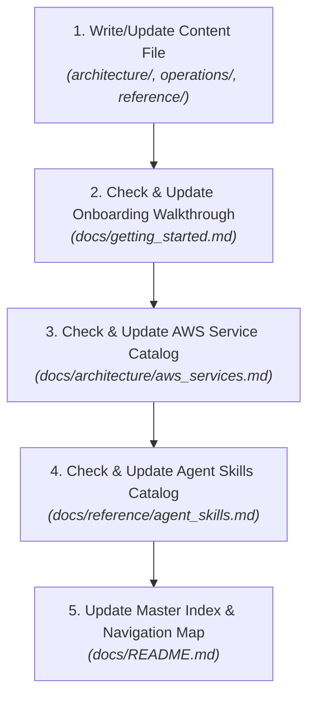

# Documentation Writer Skill (`docs-writer`)

This skill provides a systematic process for authoring and updating documentation in `docs/` whenever a new feature, infrastructure component, architectural change, or agent skill is created.

---

## 1. Reference Standards

Always follow the authoritative rules in:
[Documentation Standards Reference](../references/documentation_standards.md)

---

## 2. Categorization & Placement Protocol

Before writing any document, classify the target information according to **Single Responsibility**:

| If the information is... | Place it in... | Standard Requirements |
| :--- | :--- | :--- |
| **Conceptual / Design** (How it works, data flow, service catalog) | `docs/architecture/<name>.md` | Must be in English. Must include Mermaid diagrams. No setup terminal commands. |
| **Procedural / Actionable** (How to do X, CLI steps, console setup) | `docs/operations/<name>.md` | Must be in English. Step-by-step CLI commands & operational warnings. |
| **Specifications / Reference** (Folder specs, state keys, YAML blueprints, skills) | `docs/reference/<name>.md` | Must be in English. Code blocks, specs, state key tables. |

---

## 3. Emoji, Naming & Path Standards

* **Emoji Restriction**: Do NOT add emojis by default. Emojis are permitted ONLY inside `docs/README.md`. In non-README files (`getting_started.md`, `architecture/`, `operations/`, `reference/`), the ONLY permitted emojis are blue-squared symbol emojis used for step numbering or alerts (`ℹ️`, `⚠️`, `❗`, `1️⃣`, `2️⃣`, `3️⃣`, `4️⃣`, `5️⃣`, `6️⃣`, `7️⃣`, `8️⃣`, `9️⃣`, `🔟`). Decorative emojis (e.g. 🚀, 🗺️, 📚, 📄, 🔍, 🛠️) are prohibited in non-README files.
* **Accurate Naming & Descriptions**: File names, headings, and catalog descriptions in `docs/README.md` must accurately reflect the technical content. Do NOT use misleading titles (e.g., use `infrastructure_standards.md` instead of `project_planning.md` for architecture/directory standards).
* **No Host-Specific Absolute Paths**: NEVER hardcode workstation paths, user home directories, or machine-specific environments (e.g. `/home/jose/...`, `/home/user/...`, `/Users/dev/...`). Always use relative paths or generic placeholders such as `<REPO_ROOT>`.

---

## 4. Mandatory Indexing & Analysis Plan

Whenever authoring or updating documentation, execute this analysis plan to verify and maintain 100% indexing consistency across the documentation hub:

### Mandatory Indexing Checklist:
1. **`docs/README.md` (Master Index)**:
   * Is the file linked under the correct section with an accurate, non-misleading title and description?
   * Is the file represented as a node in the Mermaid Navigation Map?
2. **`docs/getting_started.md` (Linear Guide)**:
   * Does the change affect setup steps, environment variables, or CLI execution? If so, update the relevant step.
3. **`docs/architecture/aws_services.md` (AWS Services Catalog)**:
   * Does the change involve any new or modified AWS service (primary or secondary, e.g. SSM Parameter Store, IAM, S3, Lambda, API Gateway)? If so, ensure it is cataloged with Purpose and Project Role.
4. **`docs/reference/agent_skills.md` (Skills Catalog)**:
   * If a new skill was added/modified under `.agent/skills/<skill_name>/SKILL.md`, catalog its **Manual Launch Command** and **Activation Keywords**.

---

## 5. Quality Self-Check

Before finishing, verify:
* [ ] Is the document written 100% in English?
* [ ] Is the document placed in the correct directory (`architecture/`, `operations/`, or `reference/`)?
* [ ] Are emojis strictly compliant (allowed only in `docs/README.md`, or blue square number/alert emojis in non-README files)?
* [ ] Are filenames and descriptions accurate and representative of the content (no misleading names like `project_planning.md`)?
* [ ] Are there NO machine-specific absolute host paths (e.g. `/home/user/...`, `/Users/dev/...`)?
* [ ] Are there NO `README.md` files created inside subfolders?
* [ ] Are all affected files (`docs/README.md`, `docs/getting_started.md`, `docs/architecture/aws_services.md`, `docs/reference/agent_skills.md`) analyzed and updated?
* [ ] Do all relative markdown links point to existing files?

