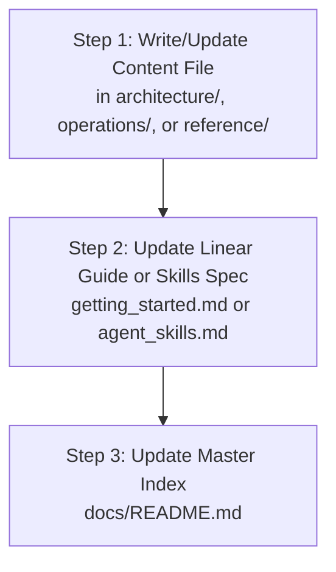

# Documentation Writer Skill (`docs-writer`)

This skill provides a systematic process for authoring and updating documentation in `docs/` whenever a new feature, infrastructure component, architectural change, or agent skill is created.

---

## 1. Reference Standards

Always follow the authoritative rules in:
👉 **[Documentation Standards Reference](../references/documentation_standards.md)**

---

## 2. Categorization & Placement Protocol

Before writing any document, classify the target information according to **Single Responsibility**:

| If the information is... | Place it in... | Standard Requirements |
| :--- | :--- | :--- |
| **Conceptual / Design** (How it works, data flow, service catalog) | `docs/architecture/<name>.md` | Must be in English. Must include Mermaid diagrams. No setup terminal commands. |
| **Procedural / Actionable** (How to do X, CLI steps, console setup) | `docs/operations/<name>.md` | Must be in English. Step-by-step CLI commands & operational warnings. |
| **Specifications / Reference** (Folder specs, state keys, YAML blueprints, skills) | `docs/reference/<name>.md` | Must be in English. Code blocks, specs, state key tables. |

---

## 3. Strict 3-Step Update Sequence

To guarantee complete indexing and prevent broken walkthroughs, execute updates in this exact order:

### Step 1: Write/Update Content File
* Create or modify the document inside `architecture/`, `operations/`, or `reference/`.
* Write exclusively in **English**.
* Embed GitHub-Flavored Mermaid diagrams (`graph TD` or `sequenceDiagram`) for flows and concepts.
* Use standard Markdown links (`[text](relative/path.md)`).

### Step 2: Update Linear Walkthrough or Skills Catalog
* If the change alters how a developer spins up or configures the infrastructure, update `docs/getting_started.md`.
* **Skill Auto-Documentation**: If a new skill was created under `.agent/skills/<skill_name>/SKILL.md`:
  1. Define its **Manual Launch Command** (e.g. `@skill-name`).
  2. Define its **Activation Keywords** (e.g. `audit docs`, `write docs`).
  3. Update [docs/reference/agent_skills.md](../../docs/reference/agent_skills.md) adding the new skill, location, manual command, keywords, and purpose to the catalog table.

### Step 3: Update Master Index (`docs/README.md`)
* Add the new/updated file to the Document Catalog table in `docs/README.md`.
* If a new document or component was added, update the **Mermaid Navigation Map** in `docs/README.md` to include the node.

---

## 4. Quality Self-Check

Before finishing, verify:
* [ ] Is the document written 100% in English?
* [ ] Is the document placed in the correct directory (`architecture/`, `operations/`, or `reference/`)?
* [ ] Are there NO `README.md` files created inside subfolders?
* [ ] If a skill was created, is it cataloged in `docs/reference/agent_skills.md` with its **Manual Launch Command** and **Activation Keywords**?
* [ ] Is the file registered and linked in `docs/README.md`?
* [ ] Do all relative markdown links point to existing files?
