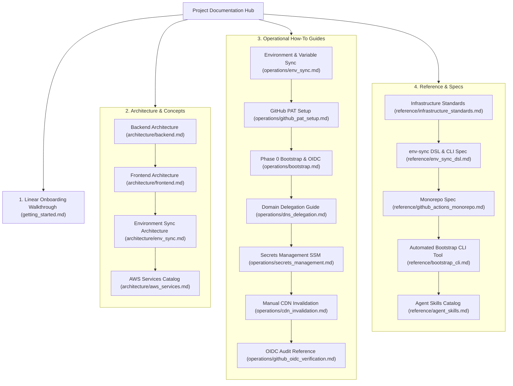

# 📚 cleanmybelly Cloud Infrastructure Documentation Hub

Welcome to the **cleanmybelly** cloud infrastructure documentation hub. This repository contains detailed technical documentation, operational manuals, architecture blueprints, and agent skills specifications for our AWS serverless ecosystem.

---

## 🚀 Quick Start for New Developers

If you are new to the project or deploying the infrastructure from zero, start directly with the linear step-by-step onboarding guide:

👉 **[Getting Started: Complete Infrastructure Deployment Guide](getting_started.md)**

To synchronize environment variables and generate local Terraform `.tfvars` and `.tfbackend` files:
👉 **[Environment & Variables Synchronization Guide](operations/env_sync.md)** (`python3 tools/env_sync.py`)

Alternatively, you can automate the Phase 0 bootstrap setup using our CLI tool:
👉 **[Automated Bootstrap CLI Tool Reference](reference/bootstrap_cli.md)** (`python3 tools/bootstrap.py`)

---

## 🗺️ Documentation Master Navigation Map

---

## 📚 Document Catalog Index

### 1. Architectural Explanations (`architecture/`)
Conceptual documentation explaining how system components interact under the hood:
* **[Backend Architecture](architecture/backend.md)**: Serverless compute flow, API Gateway routing, Lambda handlers, and DynamoDB data persistence.
* **[Frontend Architecture](architecture/frontend.md)**: Static content distribution using Client-Side Rendering (CSR), CloudFront CDN edge caching, and private S3 buckets.
* **[Environment Sync Architecture](architecture/env_sync.md)**: Deterministic multi-scope DSL engine, leaf module autodiscovery, Partial Backend Configuration, and bidirectional synchronization mechanics.
* **[AWS Services Catalog](architecture/aws_services.md)**: Detailed catalog of the 11 AWS services powering the project.

### 2. Operational Procedures (`operations/`)
Actionable, step-by-step how-to guides for specific administrative and operational tasks:
* **[Environment & Variable Sync](operations/env_sync.md)**: Step-by-step instructions for syncing environment variables, adding new parameters, generating backend configs, and performing CI/CD consistency validation.
* **[GitHub PAT Setup](operations/github_pat_setup.md)**: Instructions for generating and scoping a GitHub Personal Access Token for Terraform Phase 0 bootstrapping.
* **[Bootstrap & Federation Setup](operations/bootstrap.md)**: Phase 0 setup of S3 remote state buckets, deployer credentials, and GitHub OIDC trust via Terraform and `env-sync`.
* **[Domain Delegation Guide](operations/dns_delegation.md)**: Procedure for delegating domain name servers from Namecheap to AWS Route 53.
* **[Application Secrets Management](operations/secrets_management.md)**: Instructions for adding and retrieving application secrets in AWS Systems Manager Parameter Store.
* **[Static Asset Sync & CDN Invalidation](operations/cdn_invalidation.md)**: CLI commands to manually sync compiled Next.js assets to S3 and flush CloudFront edge cache.
* **[GitHub OIDC Verification](operations/github_oidc_verification.md)**: Policy reference for auditing IAM role permissions and trust relationships.

### 3. Technical References (`reference/`)
Specifications, directory layouts, and configuration blueprints:
* **[Infrastructure Directory & State Standards](reference/infrastructure_standards.md)**: Module directory layout, environment isolation strategy, Partial Backend Configuration model, and S3 remote state key hierarchy.
* **[`env-sync` DSL & Configuration Specification](reference/env_sync_dsl.md)**: Formal EBNF grammar, scope topography, CLI flags, leaf module targets, and gitignore version control matrix.
* **[Monorepo CI/CD Pipeline Specification](reference/github_actions_monorepo.md)**: Path-triggered GitHub Actions workflow blueprint (`deploy-frontend.yml`).
* **[Automated Bootstrap CLI Tool](reference/bootstrap_cli.md)**: Specifications, interactive prompts, execution phases, and output format for `tools/bootstrap.py`.
* **[Agent Skills Catalog & Auto-Doc Standard](reference/agent_skills.md)**: Specifications, triggers, and catalog of repository agent skills (`docs-auditor`, `docs-writer`, `context-loader`, `context-compressor`).

---

## ℹ️ Important Architecture Note (Terraform State Isolation & Backend Configuration)

> **State Isolation & Partial Backend Configuration:**
> 1. Only `aws/pre-infra/bootstrap` runs with **local state**, as its sole purpose is creating the S3 Remote State bucket (`cleanmybelly-tfstate-v1-*`).
> 2. All subsequent modules (`aws/pre-infra/iam-deployer`, `aws/pre-infra/github/*`, and `/aws/infra/...`) store their `.tfstate` files securely inside the **S3 Remote State bucket**.
> 3. Rather than modifying tracked `.tf` files with hardcoded bucket names, the repository implements Terraform **Partial Backend Configuration**. The bucket parameter is injected dynamically via `backend.tfbackend` files generated by `tools/env_sync.py` (`terraform init -backend-config=backend.tfbackend`).
> 4. This guarantees zero dirty diffs in Git, complete auditability, and seamless synchronization across developer environments.
