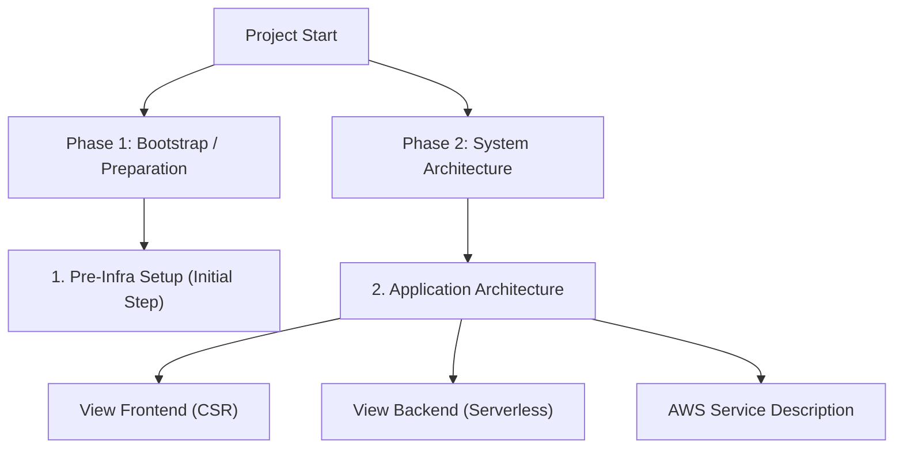

# Cloud Infrastructure Documentation Hub

Welcome to the cleanmybelly infrastructure documentation hub. Here you will find detailed guides to provision, configure, and understand the AWS serverless cloud ecosystem for this project.

---

## Documentation Navigation Map

Use the diagram and links below to navigate through the different phases of the infrastructure lifecycle:

| Phase / Section | Document Link | Purpose |
| :--- | :--- | :--- |
| **Step 1: Configure Remote Backend** | [Pre-Infrastructure Guide](pre-infra/README.md) | Configures the remote S3 bucket for state storage and creates the automation user (`terraform-deployer`). |
| **Step 2: App Infrastructure** | [Architecture Router](infra/README.md) | Unified flowcharts and mappings for both frontend and backend in production. |
| **General Services** | [AWS Services Guide](infra/general.md) | Descriptive catalog of all AWS services used in this repository. |
| **Processing and Computing** | [Serverless Backend Details](infra/backend.md) | Architecture and sequence diagram for Lambda, API Gateway, and DynamoDB. |
| **Content Delivery** | [CSR Frontend Details](infra/frontend.md) | Optimized static file distribution using CloudFront and S3. |

---

## Important Security Warning (Terraform State)

> **Local State of the Pre-Infrastructure:**
> 1. The `pre-infra` directory is executed **locally** to create the S3 bucket where the state of the main infrastructure (`/infra`) will reside.
> 2. The state of the `pre-infra` directory itself (`terraform.tfstate`) is saved locally on your machine and is added to `.gitignore` to prevent secret leaks.
> 3. **Do not delete this local `terraform.tfstate` file.** If it is removed, Terraform will lose track of your bootstrap resources (S3 bucket and IAM user), making it impossible to update or destroy the base infrastructure in the future. It is highly recommended to back up this file to a secure team credential vault once deployed.
