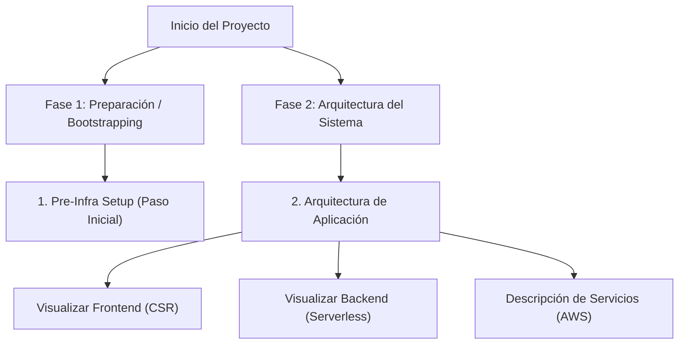

# Centro de Documentación de Infraestructura Cloud

¡Bienvenido al centro de documentación de la infraestructura de cleanmybelly! Aquí encontrarás las guías detalladas para aprovisionar, configurar y comprender el ecosistema Cloud de AWS para este proyecto.

---

## Mapa de Navegación de la Documentación

Utiliza el siguiente diagrama y enlaces para navegar por las diferentes fases del ciclo de vida de la infraestructura:

| Fase / Secciones | Archivo / Documento | Propósito |
| :--- | :--- | :--- |
| **Paso 1: Configurar Backend Remoto** | [Guía de Pre-Infraestructura](pre-infra/README.md) | Configura el bucket de S3 remoto para estados y crea el usuario de automatización (`terraform-deployer`). |
| **Paso 2: Infraestructura de la App** | [Enrutador de Arquitectura](infra/README.md) | Mapeo y diagramas de flujo integrados del Frontend y Backend en producción. |
| **Servicios Generales** | [Guía de Servicios AWS](infra/general.md) | Catálogo descriptivo de los servicios cloud de AWS utilizados en este repositorio. |
| **Procesamiento y Cómputo** | [Detalle del Backend Serverless](infra/backend.md) | Arquitectura y diagrama de secuencia de Lambda, API Gateway y DynamoDB. |
| **Entrega de Contenido** | [Detalle del Frontend CSR](infra/frontend.md) | Distribución estática optimizada con CloudFront y S3. |

---

## Advertencia de Seguridad Importante (Estado de Terraform)

> [!IMPORTANT]
> **El Estado Local de la Pre-Infraestructura:**
> 1. La carpeta `pre-infra` se ejecuta de manera **local** y crea el bucket de S3 donde se alojará el estado de la infraestructura principal (`/infra`).
> 2. El estado de la propia carpeta `pre-infra` (`terraform.tfstate`) se guarda localmente en tu computadora y está configurado en `.gitignore` para prevenir fugas de secretos.
> 3. **No borres este archivo `.tfstate` local.** Si se elimina, Terraform perderá el rastreo de tus recursos de arranque (Bucket de S3 y Usuario de IAM), impidiendo actualizar o destruir la infraestructura base en el futuro. Se recomienda respaldarlo en una bóveda segura de equipo una vez desplegado.
