# Cloud Infrastructure Documentation Hub

Welcome to the **cleanmybelly** cloud infrastructure documentation hub. This repository contains detailed technical documentation, operational manuals, architecture blueprints, and agent skills specifications for our AWS serverless ecosystem.

---

## 🚀 Quick Start for New Developers

If you are new to the project or deploying the infrastructure from zero, start directly with the linear step-by-step onboarding guide:

👉 **[Getting Started: Complete Infrastructure Deployment Guide](getting_started.md)**

---

## 🗺️ Documentation Master Navigation Map

```mermaid
graph TD
    Start[Project Documentation Hub] --> GS["1. Linear Onboarding Walkthrough<br>(getting_started.md)"]

    Start --> Arch[2. Architecture & Concepts]
    Arch --> Arch_Back["Backend Architecture<br>(architecture/backend.md)"]
    Arch --> Arch_Front["Frontend Architecture<br>(architecture/frontend.md)"]
    Arch --> Arch_AWS["AWS Services Catalog<br>(architecture/aws_services.md)"]

    Start --> Ops[3. Operational How-To Guides]
    Ops --> Ops_Boot["Phase 0 Bootstrap & OIDC<br>(operations/bootstrap.md)"]
    Ops --> Ops_DNS["Domain Delegation Guide<br>(operations/dns_delegation.md)"]
    Ops --> Ops_Sec["Secrets Management (SSM)<br>(operations/secrets_management.md)"]
    Ops --> Ops_CDN["Manual CDN Invalidation<br>(operations/cdn_invalidation.md)"]
    Ops --> Ops_OIDC["OIDC Audit & Policy Reference<br>(operations/github_oidc_verification.md)"]

    Start --> Ref[4. Reference & Specs]
    Ref --> Ref_Plan["Directory & State Keys Layout<br>(reference/project_planning.md)"]
    Ref --> Ref_Pipe["GitHub Actions Monorepo Spec<br>(reference/github_actions_monorepo.md)"]
    Ref --> Ref_Skills["Agent Skills Catalog & Auto-Doc<br>(reference/agent_skills.md)"]
```

---

## 📚 Document Catalog Index

### 1. Architectural Explanations (`architecture/`)
Conceptual documentation explaining how system components interact under the hood:
* **[Backend Architecture](architecture/backend.md)**: Serverless compute flow, API Gateway routing, Lambda handlers, and DynamoDB data persistence.
* **[Frontend Architecture](architecture/frontend.md)**: Static content distribution using Client-Side Rendering (CSR), CloudFront CDN edge caching, and private S3 buckets.
* **[AWS Services Catalog](architecture/aws_services.md)**: Detailed catalog of the 9 AWS services powering the project.

### 2. Operational Procedures (`operations/`)
Actionable, step-by-step how-to guides for specific administrative and operational tasks:
* **[Bootstrap & Federation Setup](operations/bootstrap.md)**: Phase 0 setup of S3 remote state buckets, deployer credentials, and GitHub OIDC trust via Terraform.
* **[Domain Delegation Guide](operations/dns_delegation.md)**: Procedure for delegating domain name servers from Namecheap to AWS Route 53.
* **[Application Secrets Management](operations/secrets_management.md)**: Instructions for adding and rotating encrypted SSM Parameter Store secrets via CLI and Web Console.
* **[Static Asset Sync & CDN Invalidation](operations/cdn_invalidation.md)**: CLI commands to manually sync compiled Next.js assets to S3 and flush CloudFront edge cache.
* **[GitHub OIDC Verification](operations/github_oidc_verification.md)**: Policy reference for auditing IAM role permissions and trust relationships.

### 3. Technical References (`reference/`)
Specifications, directory layouts, and configuration blueprints:
* **[Infrastructure Planning & Standards](reference/project_planning.md)**: Folder structure specifications, environment isolation strategy, and S3 state key naming standards.
* **[Monorepo CI/CD Pipeline Specification](reference/github_actions_monorepo.md)**: Path-triggered GitHub Actions workflow blueprint (`deploy-frontend.yml`).
* **[Agent Skills Catalog & Auto-Doc Standard](reference/agent_skills.md)**: Specifications, triggers, and catalog of repository agent skills (`docs-auditor`, `docs-writer`).

---

## ⚠️ Important Security Warning (Terraform Local State)

> **Local State Files of the Bootstrap Modules (`aws/pre-infra`):**
> 1. The bootstrap modules (`aws/pre-infra/bootstrap` and `aws/pre-infra/github/*`) run **locally** to provision the base AWS environment and OIDC trust.
> 2. The local state files (`terraform.tfstate`) are git-ignored to prevent secret leaks.
> 3. **Do not delete these local state files.** Removing them causes Terraform to lose track of base resources (S3 state bucket, IAM user, OIDC provider, roles, and repository settings). Back up these state files to a secure team credential vault.
