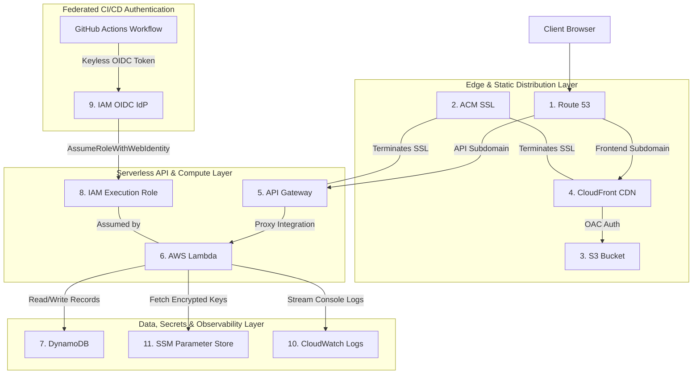

# AWS Services Catalog

This document provides a descriptive reference for each AWS service that forms part of the **cleanmybelly** infrastructure stack.

---

## AWS Infrastructure Ecosystem Diagram

---

## Service Catalog

### 1. Amazon Route 53
* **Purpose**: Highly available and scalable Domain Name System (DNS) web service.
* **Project Role**: Routes domain requests (`cleanmybelly.com` and subdomains) to CloudFront (Frontend) and API Gateway (Backend).

### 2. AWS Certificate Manager (ACM)
* **Purpose**: Automated provisioning and lifecycle management of SSL/TLS certificates.
* **Project Role**: Issues free, auto-renewing HTTPS certificates for custom domains and subdomains.

### 3. Amazon S3 (Simple Storage Service)
* **Purpose**: High-durability object storage service.
* **Project Role**: Functions as the origin bucket for static compiled web assets and stores Terraform remote state files securely.

### 4. Amazon CloudFront
* **Purpose**: Global Content Delivery Network (CDN).
* **Project Role**: Caches frontend web content at edge locations worldwide to reduce load times and protect S3 buckets via Origin Access Control (OAC).

### 5. Amazon API Gateway
* **Purpose**: Managed API management service for creating, publishing, and securing APIs.
* **Project Role**: Entry point for backend HTTP routes. Receives frontend API calls and triggers Lambda compute functions.

### 6. AWS Lambda
* **Purpose**: Event-driven serverless compute service.
* **Project Role**: Executes backend business logic on demand (e.g. validating phone numbers, processing coupon requests) without maintaining servers.

### 7. Amazon DynamoDB
* **Purpose**: Serverless NoSQL key-value database.
* **Project Role**: Stores persistent records (e.g., phone numbers, coupon codes) operating in On-Demand (`PAY_PER_REQUEST`) capacity mode.

### 8. AWS IAM (Identity and Access Management)
* **Purpose**: Access management and security policy enforcement.
* **Project Role**: Configures least-privilege execution roles for Lambda functions, local deployer users, and S3 access policies.

### 9. AWS IAM OpenID Connect (OIDC) Identity Provider
* **Purpose**: Federated keyless authentication for external identity providers.
* **Project Role**: Establishes short-lived identity trust between GitHub Actions workflows and AWS IAM, eliminating static AWS access keys in CI/CD.

### 10. Amazon CloudWatch Logs
* **Purpose**: Observability and monitoring service.
* **Project Role**: Collects and centralizes execution logs (`console.log`, trace errors) generated by AWS Lambda functions.

### 11. AWS Systems Manager (SSM) Parameter Store
* **Purpose**: Secure, centralized key-value parameter and secret management service.
* **Project Role**: Stores encrypted environment variables and application secrets (e.g., Stripe API keys, database credentials) using KMS encryption (`SecureString`).

