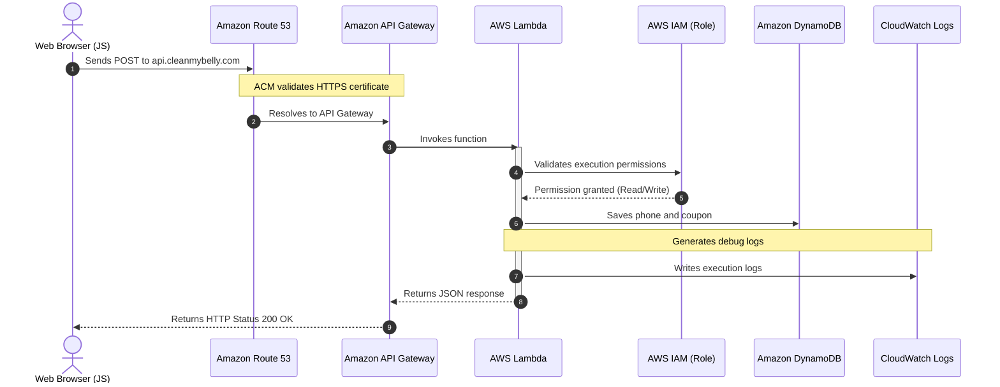

# Serverless Backend Architecture

This document details the serverless processing, API routing, and data storage design for the **cleanmybelly** project. The backend operates 100% serverless, activating only on demand to guarantee high availability and scale-to-zero cost optimization.

---

## Architectural Components

* **Amazon Route 53 (API Subdomain)**: Routes requests sent to the API subdomain (e.g., `api.cleanmybelly.com`) to the API Gateway regional endpoint.
* **AWS Certificate Manager (ACM)**: Secures HTTP traffic in transit from client browsers to API Gateway via SSL/TLS.
* **Amazon API Gateway**: HTTP gateway that maps endpoints, handles CORS, enforces throttling, and proxies requests to Lambda functions.
* **AWS Lambda**: Ephemeral compute hosting application business logic (e.g., telephone validation, coupon issuance).
* **Amazon DynamoDB (On-Demand)**: Fully-managed NoSQL database providing single-digit millisecond data persistence without server management.
* **AWS IAM (Execution Roles)**: Principle of least privilege execution roles granting Lambda write/read permissions to DynamoDB and CloudWatch Logs without hardcoding credentials.
* **Amazon CloudWatch Logs**: Centralized logging repository storing console logs, execution metrics, and error traces.

---

## Execution & Data Flow

1. **Client Request**: The client browser sends an HTTP `POST` request with payload data to `https://api.cleanmybelly.com`.
2. **DNS & HTTPS**: **Route 53** routes the request to **API Gateway**, where the SSL certificate issued by **ACM** is validated.
3. **Gateway Proxying**: **API Gateway** validates the route and invokes the designated **Lambda** function with the request event payload.
4. **Permissions & Execution**: **Lambda** assumes its dedicated **IAM Execution Role**, validating permissions to access downstream services.
5. **Persistence**: **Lambda** processes business logic and writes coupon/phone records to **DynamoDB**.
6. **Observability**: Execution logs are streamed asynchronously to **CloudWatch Logs**.
7. **Response**: Lambda returns a JSON payload to API Gateway, which responds with an HTTP status code (`200 OK`) to the browser.

---

## Sequence Diagram

