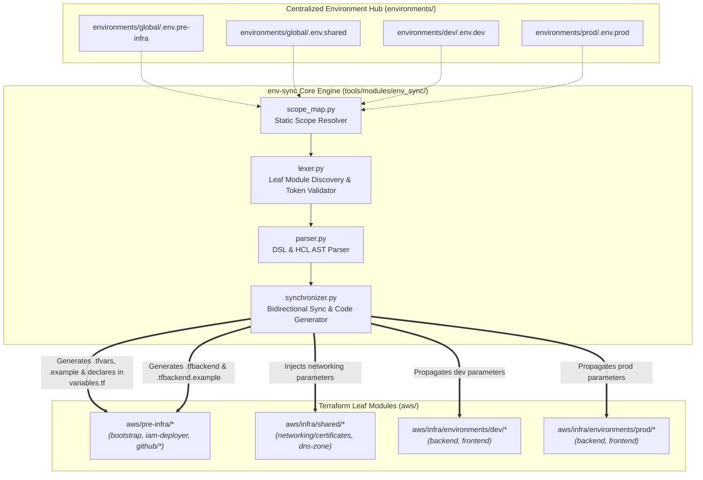
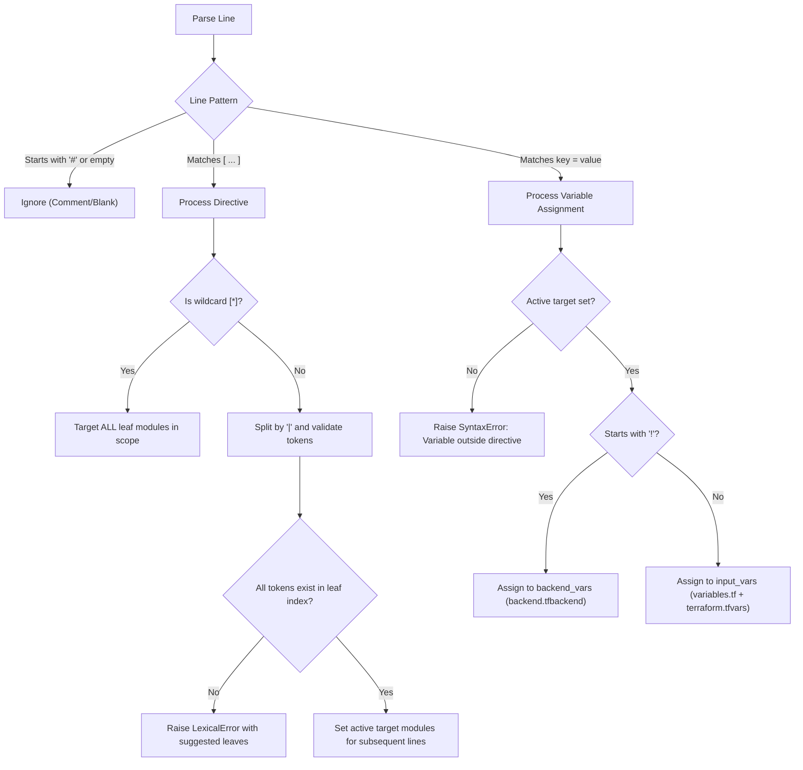
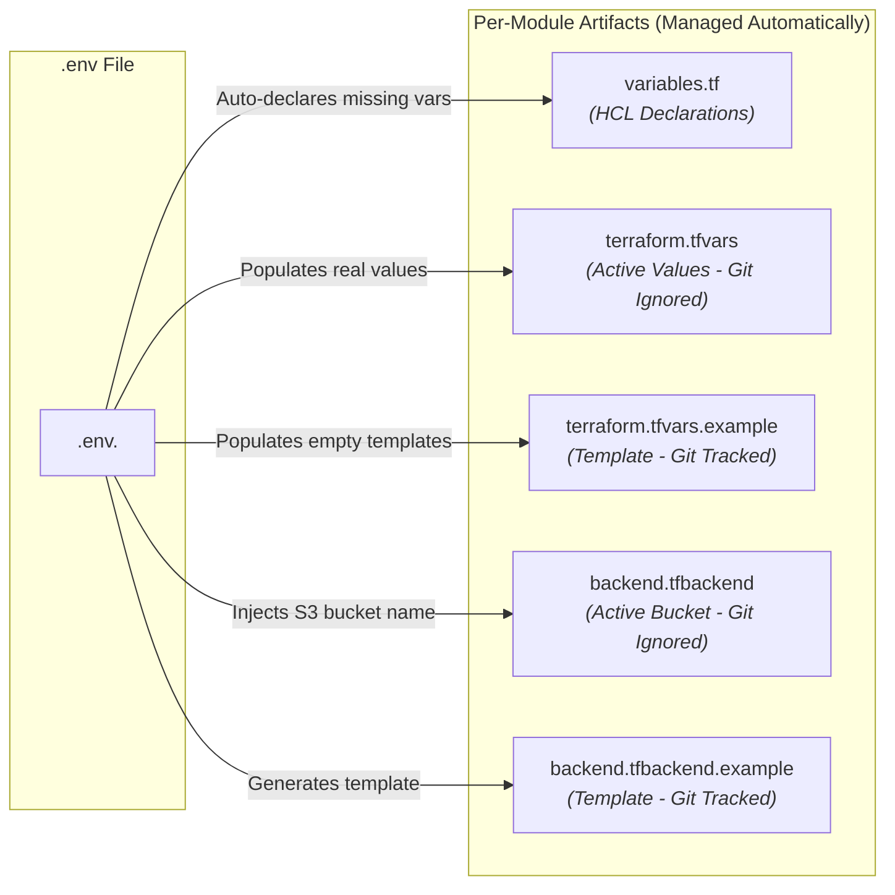

# Architecture: Unified Environment & Variable Synchronization Engine (`env-sync`)

This document details the architectural design, lexical domain-specific language (DSL), leaf autodiscovery model, and bidirectional synchronization mechanics of the **`env-sync`** configuration system.

---

## 1. Architectural Motivation & Problem Statement

In multi-module Terraform ecosystems, managing input variables and remote state backend configurations across layered directories (`aws/pre-infra/` and `aws/infra/`) typically presents three critical architectural challenges:

1. **Configuration Drift & Duplication**: Declaring identical global variables (such as `aws_region`, `project_name`, or `terraform_state_bucket_name`) across a dozen distinct root modules leads to desynchronization and manual duplication in multiple `variables.tf` and `.tfvars` files.
2. **Git Workspace Pollution (Dirty Diffs)**: Mutating `.tf` files during initial bootstrap (via global *find & replace* on placeholders like `<TERRAFORM_STATE_BUCKET_NAME>`) modifies tracked source code immediately upon repository setup, cluttering git diffs.
3. **Complex First-Clone Onboarding**: Developers cloning the repository need a friction-free mechanism to populate local variables without manually creating dozens of `.tfvars` files across deeply nested subdirectories.

The `env-sync` engine solves these challenges by introducing a **deterministic, multi-scope, DSL-driven synchronization layer** that acts as the single source of truth for both runtime variables and remote backend initialization.

---

## 2. High-Level System Architecture

The configuration architecture is organized around four distinct **Scopes**. Each scope maps a parent infrastructure directory to a centralized environment configuration file under `environments/`:



---

## 3. Scope Mapping Architecture

The **Scope Map** (`tools/modules/env_sync/scope_map.py`) defines the immutable topological boundaries of the infrastructure:

| Scope Identifier | Parent Directory (`parent_dir`) | Environment Target (`env_file`) | Template File (`example_file`) |
| :--- | :--- | :--- | :--- |
| **`pre-infra`** | `aws/pre-infra` | `environments/global/.env.pre-infra` | `environments/global/.env.pre-infra.example` |
| **`shared`** | `aws/infra/shared` | `environments/global/.env.shared` | `environments/global/.env.shared.example` |
| **`dev`** | `aws/infra/environments/dev` | `environments/dev/.env.dev` | `environments/dev/.env.dev.example` |
| **`prod`** | `aws/infra/environments/prod` | `environments/prod/.env.prod` | `environments/prod/.env.prod.example` |

Each `.env` file has authority **only** over leaf modules residing within its designated `parent_dir`. Cross-scope targeting is rejected at the lexical level.

---

## 4. Deterministic Leaf Module Autodiscovery

Instead of maintaining hardcoded lists of Terraform subdirectories, `env-sync` performs a deterministic filesystem scan at startup.

### 4.1 Leaf Module Criteria

A directory `D` is indexed as a **valid leaf module** if and only if:
1. `D` directly contains at least one `.tf` file.
2. `D` contains no subdirectories that themselves contain `.tf` files.

### 4.2 Exclusion Rules

The scanner automatically excludes the following paths during recursion:
* `.terraform/` (Terraform runtime caches and plugins)
* Any hidden directory starting with `.` (e.g. `.git/`, `.idea/`, `.vscode/`)
* Python and build cache directories (`__pycache__/`, `node_modules/`)
* Directories containing zero `.tf` files

### 4.3 Intermediate Directory Token Rejection

If a developer writes a directive referencing an intermediate directory (such as `[github]` instead of `[github/oidc | github/repository]`), the lexer analyzes the directory subtree and raises an intelligent `LexicalError` listing all valid child leaves:

```text
LexicalError in .env.pre-infra, line 8:
  Token 'github' is not a valid leaf module.
  'github' contains subdirectories with Terraform modules.
  Valid tokens for this path: github/oidc, github/repository, github/secrets-workflow
```

---

## 5. Domain-Specific Language (DSL) Specification

The `.env` files utilize a structured DSL combining section-based module targeting directives with variable assignments.

### 5.1 Directives Grammar & Syntax

```text
[modulo1 | modulo2/submodulo]    # Multi-target directive (targets specific leaf modules)
[*]                              # Universal scope wildcard (targets all leaf modules in scope)
```



### 5.2 Variable Categorization: Input Variables vs. Backend Variables

The DSL introduces the **`!` prefix** to distinguish Terraform input variables from S3 remote backend configuration parameters:

| Variable Type | Syntax in `.env` | Propagation Target | Declared in `variables.tf`? |
| :--- | :--- | :--- | :--- |
| **Input Variable** | `project_name = "val"` | `terraform.tfvars`, `terraform.tfvars.example` | **Yes** (`variable "project_name" {}`) |
| **Backend Variable** | `!terraform_state_bucket = "val"` | `backend.tfbackend`, `backend.tfbackend.example` | **No** (backend config is not an HCL variable) |

### 5.3 Precedence & Override Hierarchy

When variables are declared under multiple directives within the same `.env` file, the synchronizer applies the following precedence rule:

> **Specific Directives (`[bootstrap]`) strictly override Wildcard Directives (`[*]`).**

```ini
[*]
aws_region = "us-east-1"

[github/oidc]
aws_region = "eu-west-1"   # Overrides us-east-1 for github/oidc only
```

---

## 6. Partial Backend Configuration Architecture

To achieve zero-mutation in tracked Git files, `env-sync` implements Terraform's **Partial Backend Configuration** pattern.

### 6.1 Decoupling Runtime State from Code

1. **`providers.tf`**: The `backend "s3"` block defines static attributes (`key`, `region`, `encrypt`, `use_lockfile`) while omitting `bucket`:
   ```hcl
   terraform {
     backend "s3" {
       key          = "cleanmybelly/pre-infra/iam-deployer/terraform.tfstate"
       region       = "us-east-1"
       use_lockfile = true
     }
   }
   ```
2. **`backend.tfbackend`**: Generated dynamically by `env-sync` (and ignored by Git via `.gitignore`):
   ```hcl
   bucket = "cleanmybelly-tfstate-v1-8b543648"
   ```
3. **Execution**:
   ```bash
   terraform init -backend-config=backend.tfbackend
   ```

### 6.2 The Bootstrap Local State Exception

`aws/pre-infra/bootstrap` is the foundation module that provisions the S3 state bucket. Because the bucket does not exist prior to its execution, `bootstrap` runs with **local state**. The `env-sync` parser automatically detects that `bootstrap` has no `backend "s3"` block and excludes it from `backend.tfbackend` generation.

---

## 7. Bidirectional Synchronization & Code Generation Engine

When `python3 tools/env_sync.py` executes, it reconciles the `.env` configuration with all five managed files in every leaf module:



### 7.1 Single Source of Truth Value Precedence

If values conflict across files during analysis, `env-sync` evaluates precedence in the following strict order:

1. **`.env` Specific Directive (`[module]`)** (Highest Authority)
2. **`.env` Wildcard Directive (`[*]`)**
3. **Existing `terraform.tfvars` Local Assignment**
4. **Existing `terraform.tfvars.example` Template**
5. **Existing `variables.tf` Default Block** (Lowest Authority)

### 7.2 Automatic Variable Declaration

If a variable is added to an `.env` file but does not exist in the target module's `variables.tf`, `env-sync` safely appends a standard declaration block:

```hcl
variable "new_parameter" {
  type        = string
  description = "Synchronized via env-sync"
}
```

This ensures complete HCL syntactical validity without requiring manual edits to `variables.tf`.
