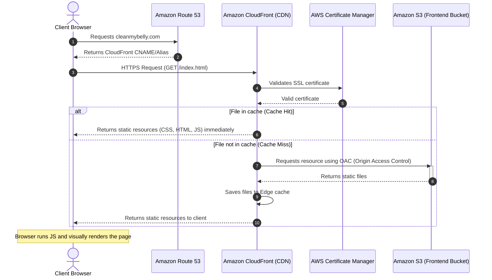

# Frontend Architecture (Client-Side Rendering)

This document details the global static asset hosting and distribution architecture for the **cleanmybelly** frontend interface. The application uses Client-Side Rendering (CSR), serving static assets (HTML, CSS, compiled JS bundle) from edge locations directly to end-user browsers.

---

## Architectural Components

* **Amazon Route 53 (Main Domain)**: Resolves the main domain (e.g., `cleanmybelly.com`) and subdomains (e.g., `www.cleanmybelly.com` or `dev.cleanmybelly.com`) to the CloudFront distribution.
* **AWS Certificate Manager (ACM)**: Manages wildcard/domain SSL certificates in region `us-east-1` required for CloudFront HTTPS termination.
* **Amazon CloudFront (CDN)**: Low-latency Content Delivery Network that caches static assets globally across Edge locations.
* **Amazon S3 (Private Bucket)**: Private storage bucket serving as the origin for compiled frontend static files. Direct public access is disabled.
* **Origin Access Control (OAC)**: Security mechanism ensuring that S3 bucket objects can only be fetched by authenticated CloudFront distribution requests.

---

## Static Content Delivery Flow

1. **User Request**: The user enters `https://cleanmybelly.com` in their browser.
2. **DNS Routing**: **Route 53** resolves the domain to the nearest **CloudFront** CDN edge location.
3. **SSL Termination**: **CloudFront** establishes a secure HTTPS session using the **ACM** certificate.
4. **Cache Evaluation**:
   * **Cache Hit**: If CloudFront holds a valid copy of requested files (`/index.html`, `main.js`, CSS) in edge memory, it returns them directly to the client.
   * **Cache Miss**: If the requested asset is not cached or has expired, CloudFront sends a signed OAC request to the origin **S3** bucket.
5. **Origin Fetch & Edge Caching**: **S3** returns the requested file to CloudFront. CloudFront caches the file at the edge location and returns it to the client.
6. **Client Rendering**: The browser receives static assets and executes JavaScript to render the application user interface locally.

---

## Static Delivery Flow Diagram

