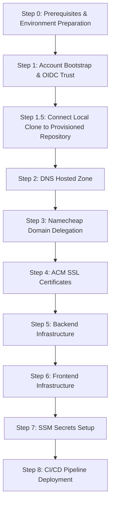

# Getting Started: Complete Infrastructure Deployment Guide

This guide provides an end-to-end, linear walkthrough for spinning up the entire **cleanmybelly** cloud ecosystem on AWS from scratch. Follow these steps in sequential order.

---

## Deployment Lifecycle Map



---

## Step 0: Prerequisites & Environment Preparation

Before executing any Terraform commands, verify you have the following installed on your machine:
1. **Terraform CLI** (`>= 1.10.0`)
2. **AWS CLI** (`v2`) configured with administrative access to your AWS Account.
3. **GitHub Personal Access Token (PAT)** with `repo` and `workflow` scopes.
   > ℹ️ **PAT Generation Guide**: [docs/operations/github_pat_setup.md](operations/github_pat_setup.md)
4. **Environment Initialization**:
   Copy the initial environment blueprints under `environments/`:
   ```bash
   cp environments/global/.env.pre-infra.example  environments/global/.env.pre-infra
   cp environments/global/.env.shared.example     environments/global/.env.shared
   cp environments/dev/.env.dev.example           environments/dev/.env.dev
   cp environments/prod/.env.prod.example         environments/prod/.env.prod
   ```

> ℹ️ **Automated CLI Alternative**: You can choose to execute Steps 1 through 4 manually following this guide, or automate them using the Python Bootstrap CLI tool (`python3 tools/bootstrap.py`). For details on the automated CLI tool, see [Bootstrap CLI Tool Reference](reference/bootstrap_cli.md).

---

## Step 1: Bootstrap Remote State & GitHub OIDC Trust

> ℹ️ **Detailed Operations Guides**: [Bootstrap Guide](operations/bootstrap.md) | [env-sync Operations](operations/env_sync.md) | [GitHub PAT Setup Guide](operations/github_pat_setup.md)

1. **Bootstrap S3 Remote State Bucket**:
   ```bash
   cd aws/pre-infra/bootstrap
   terraform init
   terraform apply
   ```
   * Retrieve the generated S3 remote state bucket name:
     ```bash
     terraform output -raw terraform_state_bucket_name
     ```

2. **Synchronize Environment & Generate Backend Configurations (`env-sync`)**:
   > ℹ️ **CRITICAL**: Only `aws/pre-infra/bootstrap` uses local state. All other modules store state in S3.
   * Open `environments/global/.env.pre-infra` and update `!terraform_state_bucket` and `terraform_state_bucket_name` with the generated bucket name.
   * Also add your `github_token` and `github_org_or_username`.
   * Run the synchronization tool from the repository root:
     ```bash
     cd ../../../
     python3 tools/env_sync.py
     ```
   * This automatically generates `backend.tfbackend` and `terraform.tfvars` across all modules without modifying tracked git files.

3. **Deploy IAM Local Deployer User**:
   ```bash
   cd aws/pre-infra/iam-deployer
   terraform init -backend-config=backend.tfbackend
   terraform apply
   ```
   * Configure local AWS CLI profile named `terraform-user` using outputs:
     ```bash
     aws configure --profile terraform-user
     ```

4. **Provision GitHub Repository**:
   ```bash
   cd ../github/repository
   terraform init -backend-config=backend.tfbackend
   terraform apply
   ```
   * Retrieve the new repository HTML URL:
     ```bash
     terraform output -raw repository_html_url
     ```

---

## Step 1.5: Connect Local Clone to Provisioned Repository

> ℹ️ **CRITICAL STEP**: The newly provisioned GitHub repository is created empty. Before deploying OIDC federation and workflow secrets in subsequent steps, you must point your local git remote to your new repository and push the codebase so the `main` branch exists on GitHub.

1. Update your local git remote origin to point to your new GitHub repository:
   ```bash
   git remote set-url origin <NEW_REPOSITORY_URL>.git
   # Example: git remote set-url origin https://github.com/JoseLopezLara/cleanmybelly.git
   ```

2. Push the full codebase to the `main` branch of your new repository:
   ```bash
   git push -u origin main
   ```

3. Deploy OIDC Federation & Workflow Secrets:
   ```bash
   # OIDC Federation Setup
   cd ../oidc
   terraform init -backend-config=backend.tfbackend
   terraform apply

   # Repository Secrets & Workflow Publishing
   cd ../secrets-workflow
   terraform init -backend-config=backend.tfbackend
   terraform apply
   ```

---

## Step 2: Provision Route 53 DNS Zone

> ℹ️ **Architecture Overview**: [docs/architecture/aws_services.md](architecture/aws_services.md#1-amazon-route-53)

1. Deploy the DNS zone:
   ```bash
   cd ../../../infra/shared/networking/dns-zone
   terraform init -backend-config=backend.tfbackend
   terraform apply
   ```
2. Copy the 4 **Name Servers** (`name_servers`) returned in the Terraform outputs.

---

## Step 3: Delegate Custom Domain (Registrar Setup)

> ℹ️ **Detailed Operations Guide**: [docs/operations/dns_delegation.md](operations/dns_delegation.md)

1. Log into your registrar (e.g. Namecheap) and set your domain's DNS to **Custom DNS**.
2. Paste the 4 AWS Name Servers retrieved from Step 2 and save.
3. Verify DNS propagation using terminal `dig`:
   ```bash
   dig cleanmybelly.com NS
   ```

---

## Step 4: Request & Validate ACM SSL Certificates

1. Request and auto-validate certificates:
   ```bash
   cd ../certificates
   terraform init -backend-config=backend.tfbackend
   terraform apply
   ```
   *(ACM validation completes automatically in 2–5 minutes via Route 53 CNAME records).*

---

## Step 5: Deploy Backend Environment (`dev` or `prod`)

> ℹ️ **Architecture Overview**: [docs/architecture/backend.md](architecture/backend.md)

1. Navigate to the environment folder:
   ```bash
   cd ../../../environments/dev/backend
   ```
2. Deploy backend resources (Lambda, API Gateway, DynamoDB):
   ```bash
   terraform init -backend-config=backend.tfbackend
   terraform apply
   ```

---

## Step 6: Deploy Frontend Environment (`dev` or `prod`)

> ℹ️ **Architecture Overview**: [docs/architecture/frontend.md](architecture/frontend.md)

1. Navigate to the environment folder:
   ```bash
   cd ../frontend
   ```
2. Deploy static hosting and CloudFront CDN:
   ```bash
   terraform init -backend-config=backend.tfbackend
   terraform apply
   ```

---

## Step 7: Configure Application Secrets in SSM

> ℹ️ **Detailed Operations Guide**: [docs/operations/secrets_management.md](operations/secrets_management.md)

Add required application secrets to AWS Systems Manager Parameter Store:
```bash
aws ssm put-parameter \
  --name "/cleanmybelly/dev/stripe_secret_key" \
  --value "sk_test_..." \
  --type "SecureString" \
  --overwrite \
  --profile terraform-user
```

---

## Step 8: Verify Automated CI/CD Pipeline

> ℹ️ **Pipeline Details**: [docs/reference/github_actions_monorepo.md](reference/github_actions_monorepo.md)

1. Build your frontend application locally:
   ```bash
   cd app/frontend
   npm ci && npm run build
   ```
2. Push your changes to `main` branch to trigger `.github/workflows/deploy-frontend.yml`.
3. Check the GitHub Actions execution log to confirm successful asset sync and CloudFront CDN invalidation.
