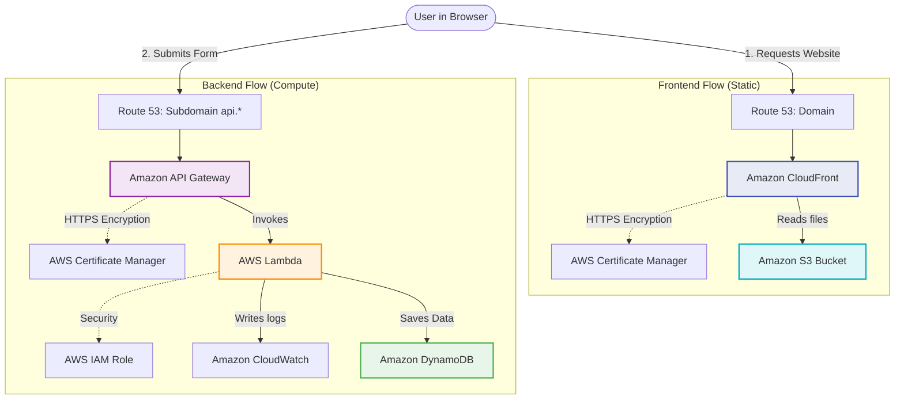

# AWS Architecture - Navigation Guide

This directory contains the detailed documentation of the Serverless Cloud infrastructure for the **cleanmybelly** project. The architecture is logically divided to allow independent maintenance of the frontend (static content distribution) and the backend (processing logic and database).

---

## Documentation Map

To explore the different infrastructure components, select one of the following guides:

| Document | Description | Focus |
| :--- | :--- | :--- |
| [1. General](general.md) | High-level overview of all AWS services used in the project. | All AWS services |
| [2. Backend](backend.md) | Details of the serverless computing flow and data persistence. Includes flowchart. | Route 53, ACM, API Gateway, Lambda, DynamoDB, CloudWatch, IAM |
| [3. Frontend](frontend.md) | Details of the global static file distribution (Client-Side Rendering). Includes flowchart. | Route 53, ACM, CloudFront, S3 |
| [4. Planning](planning.md) | Environment configuration, directory setup, modular separation, and cross-referencing. | Terraform folder structures, modules, dev/prod isolation |
| [5. Deployment](deployment.md) | Step-by-step setup sequence, secrets lookup with SSM, and cache invalidation. | Setup order, CLI commands, GitHub Actions, Parameter Store |

---

## Global Data Flow

The following diagram illustrates how end-user requests branch based on the type of interaction (accessing the website vs. sending information to the backend):

