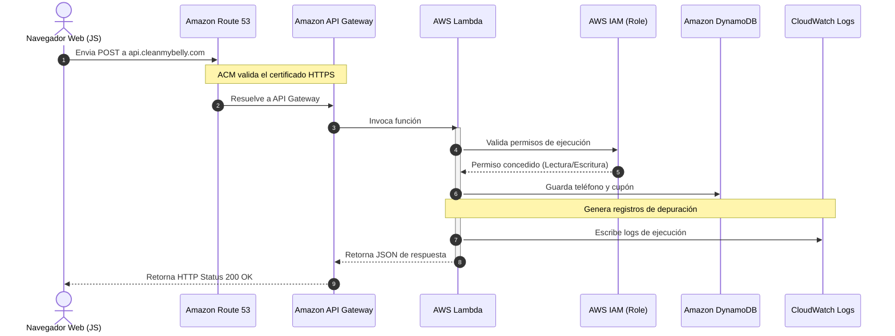

# Arquitectura del Backend Serverless

Esta sección detalla los servicios y flujos relacionados con el procesamiento lógico y almacenamiento de datos del proyecto **cleanmybelly**. El backend opera de forma 100% serverless, activándose únicamente bajo demanda y garantizando costos nulos cuando la aplicación está inactiva.

---

## ⚙️ Componentes del Backend

*   **Amazon Route 53 (Subdominio de API)**: Enruta peticiones enviadas al subdominio (ej: `api.cleanmybelly.com`) hacia el endpoint regional de API Gateway.
*   **AWS Certificate Manager (ACM)**: Certifica la seguridad HTTPS en la capa de transporte desde el cliente hasta la puerta de enlace de AWS.
*   **Amazon API Gateway**: Puerta de enlace HTTP que mapea las rutas de la API, controla el volumen de tráfico y delega la ejecución de lógica al cómputo serverless.
*   **AWS Lambda**: Cómputo serverless temporal que aloja la lógica de negocio (validación de cupones y números telefónicos).
*   **Amazon DynamoDB (On-Demand)**: Base de datos NoSQL para registrar la información de forma persistente.
*   **AWS IAM (Roles de Ejecución)**: Provee la identidad necesaria a la Lambda para interactuar de forma segura con DynamoDB y CloudWatch Logs sin quemar credenciales en el código.
*   **Amazon CloudWatch Logs**: Repositorio de trazas y depuración de la ejecución.

---

## 🔄 Flujo de Datos del Backend

1.  **Petición Cliente**: El frontend (en el navegador) ejecuta un fetch `POST` con la información del usuario al endpoint de la API.
2.  **Resolución y Cifrado**: **Route 53** deriva la petición a **API Gateway** verificando el certificado SSL emitido por **ACM**.
3.  **Invocación**: **API Gateway** despierta la función **Lambda** pasándole los parámetros recibidos.
4.  **Ejecución y Roles**: La función **Lambda** se ejecuta utilizando el rol asignado en **IAM**. Este rol le otorga permisos exclusivos para escribir en la tabla de base de datos.
5.  **Persistencia**: La función realiza una operación de escritura sobre la tabla en **DynamoDB**.
6.  **Observabilidad**: Durante todo el ciclo de ejecución, cualquier log o error es almacenado en **CloudWatch Logs** de manera asíncrona.
7.  **Respuesta**: La Lambda retorna un código HTTP de éxito/error a **API Gateway**, el cual lo traslada de vuelta al navegador.

---

## 📊 Diagrama de Flujo (Mermaid)

El siguiente diagrama detalla la interacción paso a paso de los componentes del backend:

