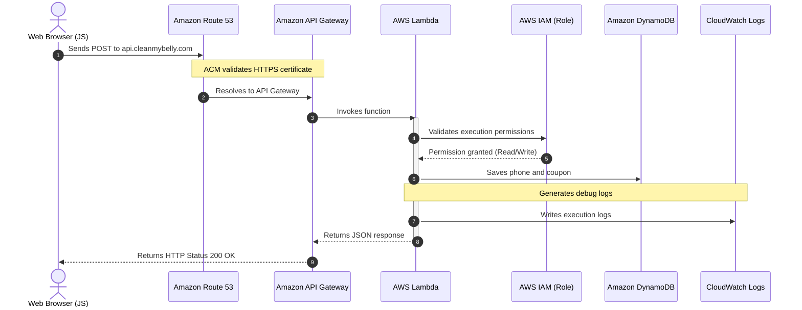

# Serverless Backend Architecture

This section details the services and data flows related to logical processing and data storage for the **cleanmybelly** project. The backend operates 100% serverless, activating only on demand and ensuring zero costs when the application is idle.

---

## Backend Components

*   **Amazon Route 53 (API Subdomain)**: Routes requests sent to the API subdomain (e.g., `api.cleanmybelly.com`) to the API Gateway regional endpoint.
*   **AWS Certificate Manager (ACM)**: Certifies HTTPS security in transit from the client to the AWS API Gateway.
*   **Amazon API Gateway**: HTTP gateway that maps API routes, controls traffic volume, and delegates execution logic to serverless compute.
*   **AWS Lambda**: Ephemeral serverless compute hosting business logic (coupon and phone number validation).
*   **Amazon DynamoDB (On-Demand)**: NoSQL database to persistently store records.
*   **AWS IAM (Execution Roles)**: Provides the necessary identity to Lambda to securely interact with DynamoDB and CloudWatch Logs without hardcoding credentials in the codebase.
*   **Amazon CloudWatch Logs**: Repository for execution traces and debugging.

---

## Backend Data Flow

1.  **Client Request**: The frontend (in the browser) executes a fetch `POST` request with the user information to the API endpoint.
2.  **Resolution and Encryption**: **Route 53** routes the request to **API Gateway** while validating the SSL certificate issued by **ACM**.
3.  **Invocation**: **API Gateway** invokes the **Lambda** function, passing the received parameters.
4.  **Execution and Roles**: The **Lambda** function runs using its assigned **IAM** execution role, which grants permissions to write to the database.
5.  **Persistence**: The function writes data to the **DynamoDB** table.
6.  **Observability**: Throughout the execution cycle, logs or errors are stored asynchronously in **CloudWatch Logs**.
7.  **Response**: Lambda returns a success/error JSON response to **API Gateway**, which forwards it back to the browser.

---

## Flow Diagram (Mermaid)

The following diagram details the step-by-step interaction of the backend components:

