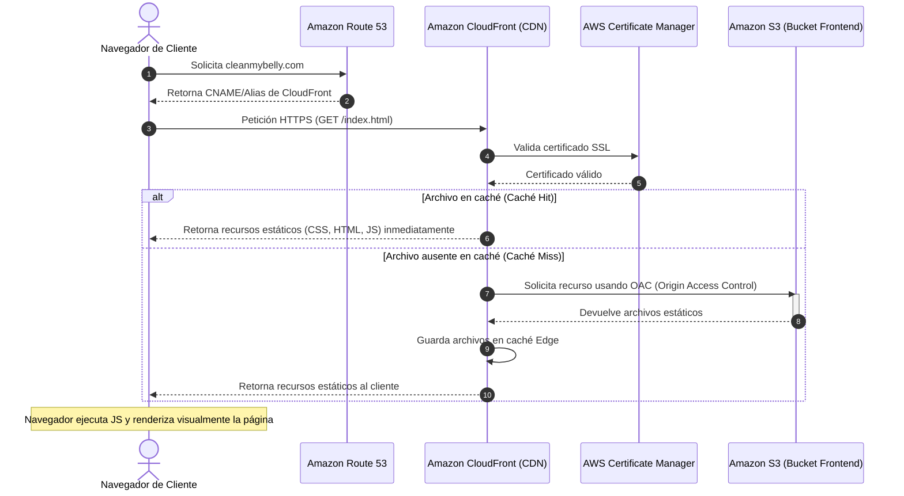

# Arquitectura del Frontend (Client-Side Rendering)

Esta sección detalla cómo se almacena y distribuye la interfaz gráfica de usuario (UI) para el proyecto **cleanmybelly**. El frontend se enfoca en Client-Side Rendering (CSR), lo que significa que el navegador del usuario final descarga los recursos estáticos una única vez y ejecuta toda la lógica visual de manera local.

---

## 🎨 Componentes del Frontend

*   **Amazon Route 53 (Dominio Principal)**: Asocia el dominio principal (ej: `cleanmybelly.com`) o subdominios alternativos (ej: `www.cleanmybelly.com`) con la distribución de CloudFront.
*   **AWS Certificate Manager (ACM)**: Emite el certificado SSL para el dominio que asegura que la conexión del usuario final a CloudFront sea HTTPS.
*   **Amazon CloudFront (CDN)**: Red global de servidores de caché. Actúa como el punto de contacto primario del usuario, asegurando que las imágenes, scripts CSS/JS y páginas HTML se sirvan desde el nodo de borde más cercano al usuario.
*   **Amazon S3 (Bucket de Origen)**: Depósito de almacenamiento seguro donde residen físicamente los archivos compilados del frontend. Este bucket está configurado para **no ser público directamente**, permitiendo el acceso únicamente a través de CloudFront.

---

## 🔄 Flujo de Distribución de Contenido

1.  **Petición Inicial**: El usuario final introduce la dirección del dominio en su navegador.
2.  **Resolución de DNS**: **Route 53** resuelve el dominio y apunta la solicitud del navegador hacia la distribución de **CloudFront**.
3.  **Terminación SSL**: **CloudFront** negocia la conexión segura con el cliente utilizando el certificado SSL almacenado en **ACM**.
4.  **Caché Check (Edge Location)**:
    *   *Caso A (Hit)*: Si CloudFront ya tiene el archivo solicitado (como la página principal o una imagen) en su caché del servidor local (Edge Location), lo entrega directamente al usuario sin ir a S3.
    *   *Caso B (Miss)*: Si es la primera vez que se solicita el archivo o si la caché expiró, CloudFront realiza una solicitud segura a través de una identidad de acceso de origen (OAI/OAC) al bucket de **S3**.
5.  **Entrega y Renderizado**: CloudFront recibe el recurso estático de S3, lo guarda en caché para solicitudes futuras de otros usuarios en esa región y entrega el archivo al navegador. El navegador renderiza el HTML y el JavaScript corre del lado del cliente.

---

## 📊 Diagrama de Flujo (Mermaid)

El siguiente diagrama detalla la arquitectura de entrega de contenido estático:

