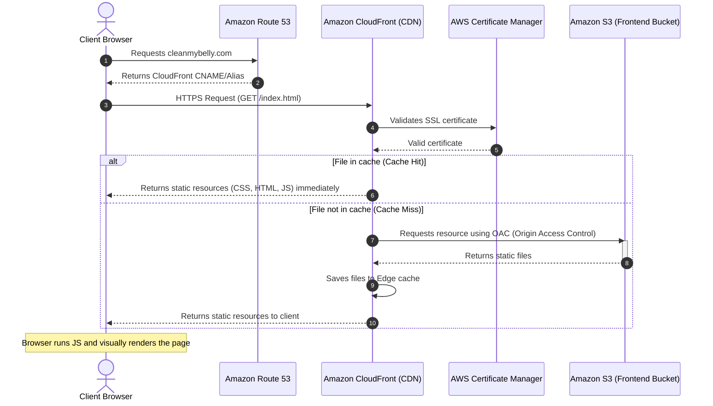

# Frontend Architecture (Client-Side Rendering)

This section details how the graphical user interface (UI) is stored and distributed for the **cleanmybelly** project. The frontend focuses on Client-Side Rendering (CSR), meaning the end-user's browser downloads static resources once and executes all visual logic locally.

---

## Frontend Components

*   **Amazon Route 53 (Main Domain)**: Associates the main domain (e.g., `cleanmybelly.com`) or alternative subdomains (e.g., `www.cleanmybelly.com`) with the CloudFront distribution.
*   **AWS Certificate Manager (ACM)**: Issues the SSL certificate for the domain to ensure that the end-user's connection to CloudFront is secure HTTPS.
*   **Amazon CloudFront (CDN)**: Global edge cache server network. Acts as the user's primary contact point, ensuring images, styles, scripts, and HTML pages are served from the edge location nearest to the user.
*   **Amazon S3 (Origin Bucket)**: Secure storage repository where compiled frontend files physically reside. This bucket is configured **not to be directly public**, allowing access only through CloudFront.

---

## Content Distribution Flow

1.  **Initial Request**: The end-user enters the domain name in their browser.
2.  **DNS Resolution**: **Route 53** resolves the domain and points the browser request to the **CloudFront** distribution.
3.  **SSL Termination**: **CloudFront** negotiates the secure connection with the client using the SSL certificate stored in **ACM**.
4.  **Cache Check (Edge Location)**:
    *   **Case A (Cache Hit)**: If CloudFront already has the requested file (such as the index page or an image) in its local edge cache, it delivers it directly to the user without querying S3.
    *   **Case B (Cache Miss)**: If the file is requested for the first time or the cache has expired, CloudFront makes a secure request using Origin Access Control (OAC) to the **S3** bucket.
5.  **Delivery and Rendering**: CloudFront receives the static resource from S3, caches it for future requests from other users in that region, and delivers the file to the browser. The browser renders the HTML and executes JavaScript locally.

---

## Flow Diagram (Mermaid)

The following diagram details the static content delivery architecture:

