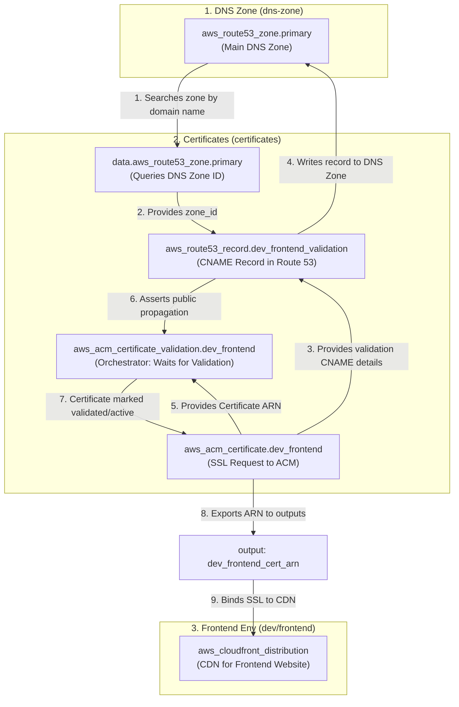

# Domain Delegation: Namecheap to AWS Route 53 (Decoupled Process)

This manual explains how to delegate your custom domain purchased at **Namecheap** to **AWS Route 53** using Nameserver (NS) records. 

Because SSL certificate validation (ACM) requires the domain to already resolve correctly to AWS, **this network infrastructure must be deployed in parts**.

---

## Execution Sequence

The process is split into 4 sequential phases:

```
[Phase 1: Create DNS Zone] 
       │
       ▼
[Phase 2: Retrieve Name Servers (Outputs)] 
       │
       ▼
[Phase 3: Delegate in Namecheap] 
       │
       ▼
[Phase 4: Create and Validate SSL Certificates]
```

---

## Step 1: Create the DNS Zone in Route 53

The first step is to create the DNS container in AWS (Hosted Zone). This will generate the specific name servers for your domain.

1. Navigate to the DNS Zone folder:
   ```bash
   cd aws/infra/shared/networking/dns-zone
   ```
2. Initialize Terraform and run the deployment:
   ```bash
   terraform init
   terraform apply
   ```

---

## Step 2: Retrieve Output Variables (Name Servers)

Once the Phase 1 deployment completes, Terraform will display the output variables in the console. You can also view them at any time by running:

```bash
terraform output
```

You will see output similar to this:
```hcl
hosted_zone_id   = "Z0123456789ABCDEF"
hosted_zone_name = "cleanmybelly.com"
name_servers     = [
  "ns-1025.awsdns-00.org",
  "ns-154.awsdns-19.com",
  "ns-782.awsdns-33.net",
  "ns-1981.awsdns-56.co.uk"
]
```

**Copy the 4 addresses** from the `name_servers` list (without quotes or commas). You will need them for the next step.

---

## Step 3: Configure Custom DNS in Namecheap (2026 Console)

Using the 4 AWS Nameserver addresses, update your domain settings in Namecheap:

1. Log in to your account at [Namecheap.com](https://www.namecheap.com/).
2. On the left sidebar of your dashboard, click **Domain List**.
3. Find your domain (e.g., `cleanmybelly.com`) and click the **Manage** button on the right.
4. Scroll down to the **NAMESERVERS** section.
5. Change the dropdown option (which says *Namecheap BasicDNS* by default) to **Custom DNS**.
6. Paste the 4 AWS Name Servers into the corresponding lines:
   * *Line 1*: `ns-1025.awsdns-00.org`
   * *Line 2*: `ns-154.awsdns-19.com`
   * *Line 3*: `ns-782.awsdns-33.net`
   * *Line 4*: `ns-1981.awsdns-56.co.uk`
   *(Note: Ensure you remove any trailing dots `.` if copied from the AWS console, though Namecheap usually removes them automatically).*
7. Click the **green checkmark icon (Save)** to the right of the fields to save your changes.

### DNS Propagation Verification
Nameserver changes are not instantaneous. Propagation typically takes **5 minutes to 2 hours** (up to 24-48 hours in rare cases).
* You can query if propagation has occurred by running in your terminal:
  ```bash
  dig cleanmybelly.com NS
  ```
  Or using free web tools like [DNSChecker.org](https://dnschecker.org/) searching for **NS** records.

---

## Step 4: Create and Validate SSL Certificates (ACM)

Once the domain is pointing to AWS Name Servers, you can proceed to request and validate the SSL certificates for your environments.

1. Navigate to the certificates folder:
   ```bash
   cd ../certificates
   ```
2. Initialize Terraform and run the deployment:
   ```bash
   terraform init
   terraform apply
   ```

This process:
1. Queries your Route 53 DNS zone via AWS API (using a `data` block).
2. Creates the SSL certificate requests in ACM.
3. Automatically creates the CNAME validation records in your Route 53 Hosted Zone.
4. Waits for validation. Since the Name Servers are already pointing to AWS, **ACM validation will complete successfully in 2 to 5 minutes** without hanging.

---

## Architecture and Resource Relationship

To better understand how these components interact, let's take the Frontend development environment (`dev_frontend`) protecting the subdomain `dev.cleanmybelly.com` as an example:



### Step-by-Step Connection:
1. **The query (`data.aws_route53_zone.primary`)**: In the certificates module, the Route 53 zone created previously is queried by its domain name (`cleanmybelly.com`). This dynamically retrieves the `zone_id`.
2. **The request (`aws_acm_certificate.dev_frontend`)**: Requests the SSL certificate for `dev.cleanmybelly.com` from ACM in the `us-east-1` region (required for CloudFront). It initially stays in a *Pending Validation* state and generates a unique token in CNAME record format.
3. **The validation record (`aws_route53_record.dev_frontend_validation`)**: Writes the ACM validation CNAME record directly into the Route 53 Hosted Zone using the queried `zone_id`.
4. **The validation (`aws_acm_certificate_validation.dev_frontend`)**: Pauses the Terraform deployment until AWS publicly validates the presence of the CNAME, activating the certificate permanently.
5. **Usage in Frontend (`aws_cloudfront_distribution`)**: The Frontend project reads the final certificate ARN from the `dev_frontend_cert_arn` output and associates it with its CloudFront distribution, enabling secure HTTPS connections for the end user.
