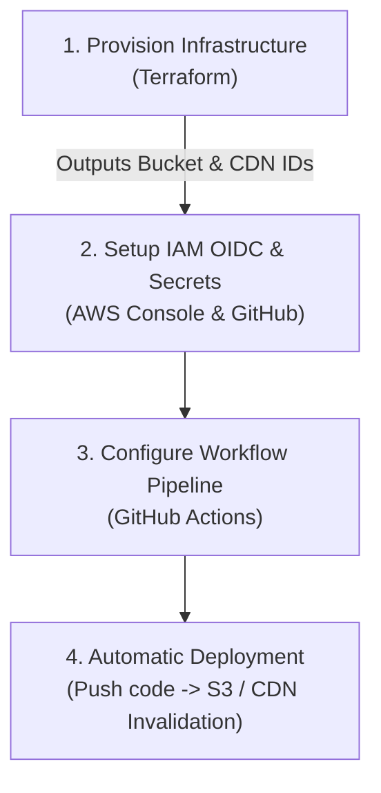

# CI/CD Automation Pipelines (Deployment Flow)

This directory serves as the documentation hub for the automated deployment pipelines of the **cleanmybelly** project. Automated pipelines bridge the gap between infrastructure provisioning (Terraform) and application release lifecycle.

---

## Deployment Flow Integration

To achieve a complete, automated deployment, you must integrate the infrastructure provisioning stage with the CI/CD pipeline stage:

---

## Pipelines Manuals Index

| Guide | Description | Target Component |
| :--- | :--- | :--- |
| **[1. GitHub Actions Setup Guide](github_actions_setup.md)** | Step-by-step instructions to configure OpenID Connect (OIDC) between GitHub Actions and AWS, register IAM roles, and set up Repository secrets. | AWS IAM OIDC & GitHub Secrets |
| **[2. Monorepo Pipeline Configuration](github_actions_monorepo.md)** | Explanation of the path-triggered workflow YAML configuration, optimization settings, Node cache setups, and dynamic Terraform output extraction. | `.github/workflows/deploy-frontend.yml` |

---

## How to Proceed

1. **Infrastructure Provisioning**: Follow the [Deployment Playbook](../../infra/deployment_playbook.md) to deploy S3, CloudFront, Lambda, and Route 53.
2. **Setup Federation**: Configure AWS OIDC Trust and create the Deployer Role using the [OIDC Federation Guide](github_actions_setup.md).
3. **Pipeline Deployment**: Commit the GitHub Actions workflow using the configurations shown in the [Monorepo Pipeline Guide](github_actions_monorepo.md).
