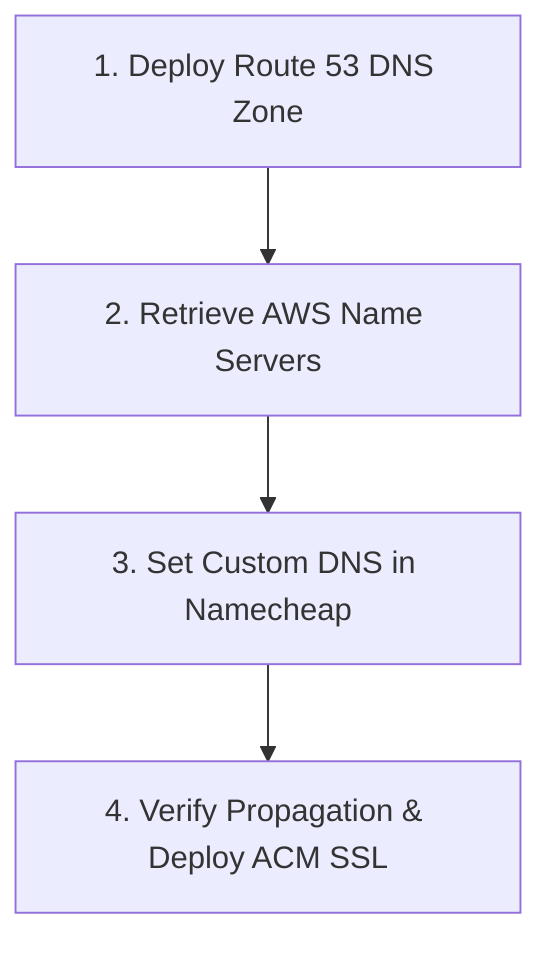
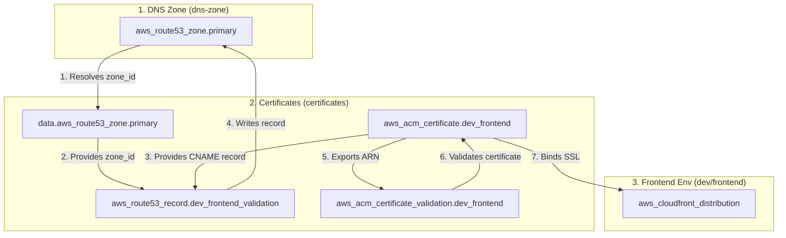

# Operations: Domain Delegation (Namecheap to AWS Route 53)

This guide explains how to delegate a custom domain purchased at **Namecheap** to **AWS Route 53** using Nameserver (NS) records.

---

## Execution Sequence



---

## Step 1: Deploy Route 53 DNS Zone

1. Navigate to:
   ```bash
   cd aws/infra/shared/networking/dns-zone
   ```
2. Initialize and apply:
   ```bash
   terraform init
   terraform apply
   ```

---

## Step 2: Retrieve AWS Name Servers

Run `terraform output` to display the assigned AWS Name Servers:

```hcl
name_servers = [
  "ns-1025.awsdns-00.org",
  "ns-154.awsdns-19.com",
  "ns-782.awsdns-33.net",
  "ns-1981.awsdns-56.co.uk"
]
```

Copy the 4 server addresses (excluding quotes).

---

## Step 3: Configure Custom DNS in Namecheap

1. Log into your [Namecheap Account](https://www.namecheap.com/).
2. Navigate to **Domain List** -> Click **Manage** next to your domain (`cleanmybelly.com`).
3. Scroll to **NAMESERVERS** section.
4. Switch dropdown from *Namecheap BasicDNS* to **Custom DNS**.
5. Paste the 4 AWS Name Servers into lines 1 through 4.
6. Click the green checkmark to save.

---

## Step 4: Verify Propagation & Deploy SSL Certificates

1. Verify DNS delegation using terminal `dig`:
   ```bash
   dig cleanmybelly.com NS
   ```
2. Once the NS records resolve to AWS, deploy SSL certificates:
   ```bash
   cd ../certificates
   terraform init
   terraform apply
   ```
   *(ACM validation completes automatically in 2 to 5 minutes).*

---

## ACM SSL Validation Architecture


