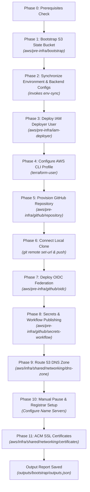

# Reference: Automated Bootstrap CLI Tool (`tools/bootstrap.py`)

This reference document specifies the design, capabilities, interactive prompt interface, execution phases, and output format of the automated Python Bootstrap CLI tool (`tools/bootstrap.py`).

---

## 1. Overview & Purpose

The **cleanmybelly Bootstrap CLI tool** automates the entire Phase 0 infrastructure setup and shared networking deployment in a single, interactive execution. 

Instead of manually navigating through multiple Terraform directories and running commands step-by-step, developers can run `python3 tools/bootstrap.py` to provision remote state storage, configure environment variables via `env-sync`, create IAM credentials, provision the GitHub repository, set up AWS OIDC federation, and deploy Route 53 DNS hosted zones and ACM SSL certificates.

---

## 2. CLI Tools Modular Architecture (`tools/`)

The CLI ecosystem follows a clean multi-tool modular architecture:

```text
cleanmybelly/
├── environments/                            # Centralized environment variable definitions
│   ├── global/
│   │   ├── .env.pre-infra.example
│   │   └── .env.shared.example
│   ├── dev/
│   │   └── .env.dev.example
│   └── prod/
│       └── .env.prod.example
├── outputs/                                # Centralized outputs directory (root)
│   ├── .gitkeep                            # Git tracked empty directory
│   └── bootstrap/                          # Generated outputs for bootstrap tool
│       ├── outputs.json                    # Infrastructure outputs report
│       ├── status.json                     # Dynamic execution tracker status
│       └── status.log                      # Live execution audit log
├── tools/                                  # Tools CLI domain
│   ├── README.md                           # Tools ecosystem overview
│   ├── bootstrap.py                        # Bootstrap CLI entrypoint orchestrator
│   ├── env_sync.py                         # Environment and variable synchronizer
│   ├── shared/                             # Core framework shared across all tools
│   │   ├── outputs/                        # Generic ExecutionTracker & OutputManager
│   │   ├── ui/                             # ANSI colors & terminal formatting logger
│   │   └── utils/                          # Subprocess runner & repo root finder
│   └── modules/                            # Modular tool implementations
│       ├── bootstrap/                      # Encapsulated bootstrap tool logic
│       │   ├── config/                     # User prompts & AWS profile selector
│       │   ├── phases/                     # The 11 execution phases
│       │   └── validators/                 # System prerequisites & IAM permissions
│       └── env_sync/                       # Encapsulated env-sync engine
│           ├── scope_map.py                # Topography and scope map definitions
│           ├── lexer.py                    # Leaf discovery & directive token validator
│           ├── parser.py                   # DSL & HCL AST parser
│           └── synchronizer.py             # Bidirectional sync engine
```

---

## 3. Execution Prerequisites

Before executing `python3 tools/bootstrap.py`, the CLI tool verifies the following system requirements:

| Prerequisite | Minimum Version / Requirement | Verification Method |
| :--- | :--- | :--- |
| **Python** | `>= 3.8` | `sys.version_info` |
| **Terraform CLI** | `>= 1.10.0` | `terraform version` |
| **AWS CLI** | `v2` | `aws --version` |
| **AWS Identity** | Active AWS CLI credentials | `aws sts get-caller-identity` |
| **AWS Permissions** | Administrative access for initial bootstrapping | IAM caller identity check & warning |
| **Git** | `>= 2.0` | `git rev-parse --is-inside-work-tree` |

---

## 4. Interactive Prompt Reference

At startup, the CLI tool prompts for configuration variables:

| Prompt | Description | Default Value | Validation Rule |
| :--- | :--- | :--- | :--- |
| **GitHub PAT** | Personal Access Token with `repo` and `workflow` scopes | None (Required) | Non-empty string |
| **GitHub Owner** | Username or organization name | `git config user.name` | Non-empty string |
| **Repository Name** | Name for the new GitHub repository | Directory name | Valid GitHub repo name |
| **Visibility** | Repository visibility (`public` or `private`) | `public` | Must be `public` or `private` |
| **Root Domain** | Domain name for Route 53 & ACM (e.g., `example.com`) | None (Required) | Valid domain format with `.` |
| **AWS Region** | AWS region for infrastructure deployment | `us-east-1` | Valid AWS region string |

---

## 5. Sequential Execution Phases



### Phase Descriptions

1. **Phase 1 (S3 State Bucket)**: Runs `terraform apply` in `aws/pre-infra/bootstrap` to create the initial S3 Remote State bucket (`cleanmybelly-tfstate-v1-*`).
2. **Phase 2 (Environment & Backend Synchronization)**: Sets `!terraform_state_bucket` in `environments/global/.env.pre-infra` and calls `env-sync` programmatically to generate `backend.tfbackend` and `terraform.tfvars` across all modules without dirty git mutations.
3. **Phase 3 (IAM Deployer User)**: Runs `terraform apply` in `aws/pre-infra/iam-deployer` to create the `terraform-deployer` user and access keys.
4. **Phase 4 (AWS Profile Setup)**: Configures local AWS CLI profile `terraform-user` with the generated deployer access keys.
5. **Phase 5 (GitHub Repository)**: Runs `terraform apply` in `aws/pre-infra/github/repository` to provision the new GitHub repository.
6. **Phase 6 (Connect Local Clone)**: Configures `origin` remote URL non-interactively using owner and PAT credentials (`https://<owner>:<PAT>@github.com/<owner>/<repo>.git`) to eliminate password prompts. Pushes codebase to `main` branch, automatically handling auto-initialized repositories via `git pull origin main --rebase --allow-unrelated-histories` and force-push fallbacks.
7. **Phase 7 (OIDC Federation)**: Runs `terraform apply` in `aws/pre-infra/github/oidc` to establish IAM OIDC trust.
8. **Phase 8 (Secrets & Workflow)**: Runs `terraform apply` in `aws/pre-infra/github/secrets-workflow` to store `AWS_ROLE_TO_ASSUME` secret and publish `.github/workflows/deploy-frontend.yml`.
9. **Phase 9 (Route 53 DNS Zone)**: Runs `terraform apply` in `aws/infra/shared/networking/dns-zone` using the `terraform-user` profile.
10. **Phase 10 (Manual Registrar Setup & Pause)**: Displays the 4 AWS Name Servers generated by Route 53 in a formatted terminal box. Pauses execution until the developer updates their registrar (e.g. Namecheap) to Custom DNS and presses Enter. Verifies DNS propagation via `dig`.
11. **Phase 11 (ACM SSL Certificates)**: Runs `terraform apply` in `aws/infra/shared/networking/certificates` to request and validate SSL certificates.

---

## 6. Incremental Output Report & Execution Tracking

During execution, outputs and status metrics are updated **incrementally after each phase** across three dedicated files in `outputs/bootstrap/`:

### A. Incremental Output Report (`outputs/bootstrap/outputs.json`)
Updated dynamically upon completion of each phase to persist infrastructure outputs (e.g. state bucket, IAM deployer, repo URL, zone ID, certificates):

```json
{
  "timestamp": "2026-08-10T12:00:00Z",
  "terraform_state_bucket": "cleanmybelly-tfstate-v1-8b543648",
  "iam_deployer_user": "terraform-deployer",
  "iam_deployer_access_key_id": "AKIA...",
  "iam_deployer_secret_access_key": "[CONFIGURED IN AWS PROFILE 'terraform-user']",
  "github_repository_url": "https://github.com/JoseLopezLara/cleanmybelly",
  "github_repository_full_name": "JoseLopezLara/cleanmybelly",
  "github_actions_role_arn": "arn:aws:iam::123456789012:role/github-actions-deployer-role",
  "route53_zone_id": "Z0123456789ABCDEF",
  "route53_name_servers": [
    "ns-1234.awsdns-12.org",
    "ns-5678.awsdns-34.co.uk",
    "ns-9012.awsdns-56.com",
    "ns-3456.awsdns-78.net"
  ],
  "acm_certificates": {
    "dev_frontend_cert_arn": "arn:aws:acm:us-east-1:123456789012:certificate/...",
    "dev_backend_cert_arn": "arn:aws:acm:us-east-1:123456789012:certificate/...",
    "prod_frontend_cert_arn": "arn:aws:acm:us-east-1:123456789012:certificate/...",
    "prod_backend_cert_arn": "arn:aws:acm:us-east-1:123456789012:certificate/..."
  }
}
```

### B. Dynamic Execution Status Tracker (`outputs/bootstrap/status.json`)
Maintains the exact execution order, target directory, timestamp, status (`PENDING`, `IN_PROGRESS`, `SUCCESS`, `FAILED`), and error details for each phase step.

### C. Live Execution Audit Log (`outputs/bootstrap/status.log`)
Appends timestamped log lines for each phase lifecycle event for easy terminal tailing and debugging if an apply step fails.

> ⚠️ **Security Note**: Output files under `outputs/*` are listed in `.gitignore` to prevent committing generated state details to source control.
