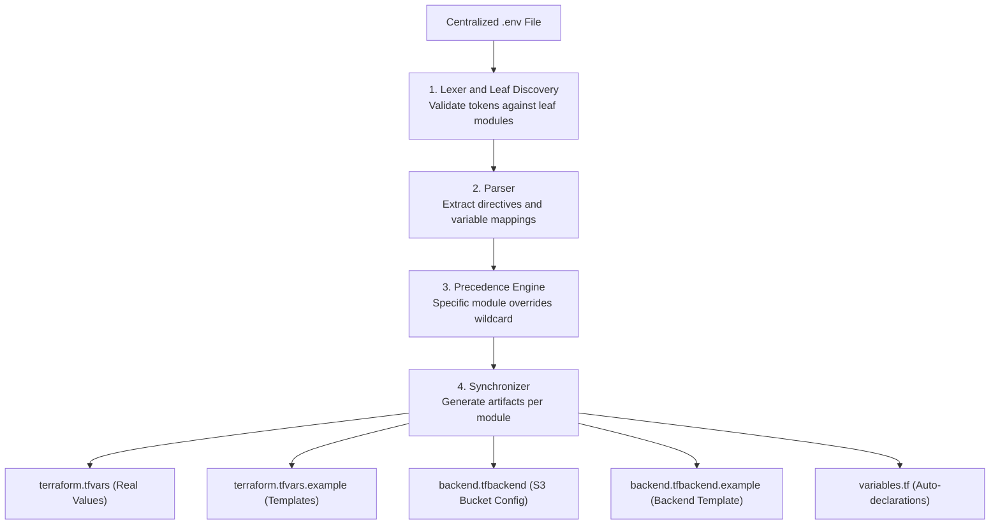

# Reference: `env-sync` DSL & Configuration Specification

This reference specification documents the formal grammar, scope mapping schemas, CLI flags, and leaf module targets of the **`env-sync`** configuration system.

---

## 1. Scope Map Topography

The `SCOPE_MAP` array (`tools/modules/env_sync/scope_map.py`) defines the top-level parent directories and their respective environment configuration files:

| Scope | Parent Directory | Environment File | Template Blueprint |
| :--- | :--- | :--- | :--- |
| `pre-infra` | `aws/pre-infra` | `environments/global/.env.pre-infra` | `environments/global/.env.pre-infra.example` |
| `shared` | `aws/infra/shared` | `environments/global/.env.shared` | `environments/global/.env.shared.example` |
| `dev` | `aws/infra/environments/dev` | `environments/dev/.env.dev` | `environments/dev/.env.dev.example` |
| `prod` | `aws/infra/environments/prod` | `environments/prod/.env.prod` | `environments/prod/.env.prod.example` |

---

## 2. DSL Processing & Compilation Lifecycle



---

## 3. Formal Grammar Specification (EBNF)

```ebnf
EnvironmentFile  ::= ( Line )*
Line             ::= ( Directive | VariableLine | Comment | EmptyLine ) "\n"

Directive        ::= "[" OPT_WS DirectiveBody OPT_WS "]"
DirectiveBody    ::= Wildcard | ModuleList
Wildcard         ::= "*"
ModuleList       ::= ModuleToken ( OPT_WS "|" OPT_WS ModuleToken )*
ModuleToken      ::= IDENTIFIER ( "/" IDENTIFIER )*

VariableLine     ::= ( BackendPrefix )? Identifier OPT_WS "=" OPT_WS Value
BackendPrefix    ::= "!"
Identifier       ::= [a-zA-Z_][a-zA-Z0-9_]*
Value            ::= QuotedString | RawString
QuotedString     ::= '"' [^"\\]* '"' | "'" [^'\\]* "'"
RawString        ::= [^\n#]*

Comment          ::= OPT_WS "#" [^\n]*
EmptyLine        ::= OPT_WS
OPT_WS           ::= [ \t]*
IDENTIFIER       ::= [a-zA-Z0-9_\-]+
```

---

## 4. Leaf Module Inventory & Target Mapping

The autodiscovery engine indexes 11 leaf modules across the repository:

| Scope | Leaf Token | Relative Path in Filesystem | Backend Type | Generated Files |
| :--- | :--- | :--- | :--- | :--- |
| `pre-infra` | `bootstrap` | `aws/pre-infra/bootstrap` | **Local** | `.tfvars`, `.tfvars.example` |
| `pre-infra` | `iam-deployer` | `aws/pre-infra/iam-deployer` | **S3 Remote** | `.tfvars`, `.tfvars.example`, `.tfbackend`, `.tfbackend.example` |
| `pre-infra` | `github/oidc` | `aws/pre-infra/github/oidc` | **S3 Remote** | `.tfvars`, `.tfvars.example`, `.tfbackend`, `.tfbackend.example` |
| `pre-infra` | `github/repository` | `aws/pre-infra/github/repository` | **S3 Remote** | `.tfvars`, `.tfvars.example`, `.tfbackend`, `.tfbackend.example` |
| `pre-infra` | `github/secrets-workflow` | `aws/pre-infra/github/secrets-workflow` | **S3 Remote** | `.tfvars`, `.tfvars.example`, `.tfbackend`, `.tfbackend.example` |
| `shared` | `networking/certificates` | `aws/infra/shared/networking/certificates` | **S3 Remote** | `.tfvars`, `.tfvars.example`, `.tfbackend`, `.tfbackend.example` |
| `shared` | `networking/dns-zone` | `aws/infra/shared/networking/dns-zone` | **S3 Remote** | `.tfvars`, `.tfvars.example`, `.tfbackend`, `.tfbackend.example` |
| `dev` | `backend` | `aws/infra/environments/dev/backend` | **S3 Remote** | `.tfvars`, `.tfvars.example`, `.tfbackend`, `.tfbackend.example` |
| `dev` | `frontend` | `aws/infra/environments/dev/frontend` | **S3 Remote** | `.tfvars`, `.tfvars.example`, `.tfbackend`, `.tfbackend.example` |
| `prod` | `backend` | `aws/infra/environments/prod/backend` | **S3 Remote** | `.tfvars`, `.tfvars.example`, `.tfbackend`, `.tfbackend.example` |
| `prod` | `frontend` | `aws/infra/environments/prod/frontend` | **S3 Remote** | `.tfvars`, `.tfvars.example`, `.tfbackend`, `.tfbackend.example` |

---

## 5. CLI Arguments & Exit Codes

```text
Usage:
  python3 tools/env_sync.py [OPTIONS]
```

### Options

| Flag | Type | Description |
| :--- | :--- | :--- |
| *(None)* | Default | Synchronizes all `.env` parameters to `.tfvars`, `.example`, and `.tfbackend` files on disk. |
| `--dry-run` | Boolean | Previews proposed file creations and updates without writing changes to disk. |
| `--validate` | Boolean | Checks synchronization status. Does not modify disk. Returns exit code `0` if in sync, `1` if out of sync. |

### Exit Codes

| Exit Code | Meaning |
| :--- | :--- |
| `0` | Execution succeeded (or workspace is 100% in sync during `--validate`). |
| `1` | Failure encountered (missing `.env` files, `LexicalError`, `SyntaxError`, or desynchronization during `--validate`). |

---

## 6. File Version Control & Gitignore Matrix

| File Type | Path Pattern | Tracked in Git? | Managed by `env-sync`? |
| :--- | :--- | :--- | :--- |
| **Active Environment Files** | `environments/**/.env.*`, `environments/**/.env` | ❌ **No** (`.gitignore`) | Manual edit / Phase 2 automation |
| **Environment Blueprints** | `environments/**/.example` | ✅ **Yes** | Manual creation / Source control |
| **Active Variable Files** | `aws/**/terraform.tfvars` | ❌ **No** (`.gitignore`) | ✅ Generated by `env-sync` |
| **Variable Example Templates** | `aws/**/terraform.tfvars.example` | ✅ **Yes** | ✅ Generated by `env-sync` |
| **Active Backend Configs** | `aws/**/backend.tfbackend` | ❌ **No** (`.gitignore`) | ✅ Generated by `env-sync` |
| **Backend Example Templates** | `aws/**/backend.tfbackend.example` | ✅ **Yes** | ✅ Generated by `env-sync` |
