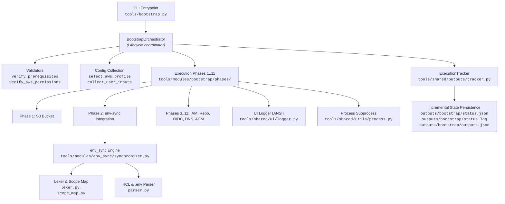

# Python Architecture & OOP Reference for CLI Tools

This document provides a comprehensive technical reference for the Python patterns, Object-Oriented Programming (OOP) architecture, import mechanisms, and inter-module communication strategies implemented across the `tools/` automation ecosystem (`tools/bootstrap.py`, `tools/env_sync.py`, `tools/shared/`, and `tools/modules/`).

---

## 1. Architectural Principles

The `tools/` ecosystem is designed with the following core architectural constraints:

1. **Zero External Dependencies**: Implemented entirely with the Python Standard Library (`pathlib`, `subprocess`, `re`, `json`, `argparse`, `sys`, `os`, `shutil`, `time`, `typing`). No `pip install` or virtual environment activation is required.
2. **Single Responsibility Principle (SRP)**: Each file owns a discrete domain (parsing, lexing, UI formatting, subprocess execution, or a single bootstrap phase).
3. **Decoupled Engine & CLI Interface**: Domain logic is encapsulated in `tools/modules/`, while CLI entrypoints (`tools/bootstrap.py`, `tools/env_sync.py`) act purely as invocation coordinators.

---

## 2. Package & Import System

Python organizes code into modules (single `.py` files) and packages (directories containing an `__init__.py` file).

### 2.1 Package Facades & `__init__.py`

The `__init__.py` file marks a directory as an importable Python package and serves as an encapsulation facade.

#### Example: [`tools/shared/ui/__init__.py`](file:///home/jose-lopez-lara/Git/cleanmybelly/tools/shared/ui/__init__.py)

```python
"""
Terminal formatting and colorized logging utilities.
"""

from tools.shared.ui.logger import (
    Colors,
    log_header,
    log_phase,
    log_success,
    log_info,
    log_warn,
    log_error
)

__all__ = [
    "Colors",
    "log_header",
    "log_phase",
    "log_success",
    "log_info",
    "log_warn",
    "log_error"
]
```

* **Encapsulation**: External callers do not need to know that the implementation resides in `logger.py`. They import directly from `tools.shared.ui`.
* **Explicit API (`__all__`)**: The `__all__` list explicitly defines public symbols exported by the package.

### 2.2 Relative vs. Absolute Imports

The codebase uses two distinct import conventions depending on context:

| Import Type | Syntax Example | When Used |
| :--- | :--- | :--- |
| **Relative Imports** | `from .lexer import discover_leaf_modules`<br>`from .scope_map import SCOPE_MAP` | Used **inside** a self-contained package (e.g. `tools/modules/env_sync/`) to reference sibling files regardless of the repository folder name. |
| **Absolute Imports** | `from tools.shared.ui import log_phase`<br>`from tools.modules.env_sync import synchronize_all` | Used across package boundaries and from entrypoints to clearly identify source packages. |

### 2.3 Dynamic Search Path Injection (`sys.path`)

When executing a script directly via `python3 tools/bootstrap.py`, Python sets `sys.path[0]` to `tools/` (the script directory), not the repository root. To enable absolute imports starting with `tools...`, the repository root is dynamically resolved and injected in [`tools/bootstrap.py`](file:///home/jose-lopez-lara/Git/cleanmybelly/tools/bootstrap.py#L18-L22):

```python
from pathlib import Path
import sys

# Ensure repository root is at the head of sys.path
REPO_ROOT = Path(__file__).resolve().parent.parent
if str(REPO_ROOT) not in sys.path:
    sys.path.insert(0, str(REPO_ROOT))
```

---

## 3. Object-Oriented Programming (OOP) Patterns

The codebase applies OOP when managing long-lived state, execution lifecycles, or structured constants.

### 3.1 Stateful Lifecycle Management & Constructors (`__init__`)

Classes with state encapsulate data, maintain file handles, and track lifecycle steps.

#### Example: [`ExecutionTracker`](file:///home/jose-lopez-lara/Git/cleanmybelly/tools/shared/outputs/tracker.py#L11-L118)

```python
class ExecutionTracker:
    """Tracks phase execution status and outputs incrementally for any tool."""
    def __init__(
        self,
        repo_root: Path,
        tool_name: str,
        phases_definition: Optional[List[Tuple[int, str, str]]] = None
    ):
        self.repo_root = repo_root
        self.tool_name = tool_name
        self.phases_definition = phases_definition or []
        self.output_dir = repo_root / "outputs" / tool_name
        self.output_dir.mkdir(parents=True, exist_ok=True)
        
        self.status_data = { ... }
        self._init_files()

    def start_phase(self, phase_num: int):
        self.status_data["current_phase"] = phase_num
        self._write_status_json()
```

* **Constructor (`__init__`)**: Initializes instance variables on `self`.
* **Explicit `self`**: `self` represents the specific instance of the class (analogous to `this` in other languages). Every instance method must declare `self` as its first parameter.
* **Encapsulated State**: Methods such as `start_phase`, `complete_phase`, and `fail_phase` update `self.status_data` and automatically persist state to disk (`outputs/<tool_name>/status.json`).

### 3.2 Static Constant Namespaces

When only structured constants are needed without instance state, classes act as clean namespaces.

#### Example: [`Colors`](file:///home/jose-lopez-lara/Git/cleanmybelly/tools/shared/ui/logger.py#L5-L15)

```python
class Colors:
    HEADER = '\033[95m'
    BLUE = '\033[94m'
    CYAN = '\033[96m'
    GREEN = '\033[92m'
    YELLOW = '\033[93m'
    RED = '\033[91m'
    RESET = '\033[0m'
    BOLD = '\033[1m'
    UNDERLINE = '\033[4m'
```

* **Usage**: Accessed statically via `Colors.GREEN` or `Colors.RESET` without instantiating an object (`Colors()`).

---

## 4. Functions, Encapsulation & Visibility Conventions

### 4.1 Pure / Stateless Utility Functions

Functions that do not require mutable instance state are implemented as standalone module-level functions.

* **Subprocess execution**: [`run_cmd`](file:///home/jose-lopez-lara/Git/cleanmybelly/tools/shared/utils/process.py#L18-L36) takes input parameters and environment variables, runs the command, and returns the result without saving internal state.
* **File parsing**: [`parse_env_file`](file:///home/jose-lopez-lara/Git/cleanmybelly/tools/modules/env_sync/parser.py#L16-L94) takes file paths and module token definitions, parses the DSL, and returns a structured dictionary.

### 4.2 Private / Internal Function Conventions (`_function_name`)

Python enforces encapsulation through naming conventions rather than language keywords (`private`, `protected`). A leading single underscore (`_`) signifies that a function or method is internal to that module or class.

```python
# Internal helper function in tools/modules/env_sync/lexer.py
def _is_dir_excluded(dir_name: str) -> bool:
    """Checks if a directory should be skipped by the scanner."""
    if dir_name.startswith("."):
        return True
    return dir_name in EXCLUDED_DIR_NAMES

# Internal helper function in tools/modules/env_sync/synchronizer.py
def _inject_variables_into_env_file(env_file_path: str, ...) -> bool:
    """Injects or updates discovered variables under [module_token]."""
    ...
```

---

## 5. Type Hinting & Unpacking

The codebase uses standard library `typing` to define strict contracts.

```python
from typing import Dict, List, Tuple, Optional, Set

def synchronize_all(
    repo_root: str,
    dry_run: bool = False,
    validate_only: bool = False,
) -> Tuple[bool, List[str], List[str]]:
```

* **`Tuple[bool, List[str], List[str]]`**: Declares that the return value is a 3-element tuple containing a success flag, a list of applied/proposed changes, and a list of errors.
* **Tuple Unpacking**: Enables clean multi-variable assignment in calling modules:
  ```python
  success, changes, errors = synchronize_all(repo_root=repo_root, dry_run=args.dry_run, validate_only=args.validate)
  ```

---

## 6. Inter-Module Communication Architecture

The following diagram illustrates how components across `tools/` collaborate during an execution run:



### Communication Mechanisms:

1. **State by Reference (`outputs` Dictionary)**:
   The orchestrator initializes a single dictionary [`self.outputs = {...}`](file:///home/jose-lopez-lara/Git/cleanmybelly/tools/bootstrap.py#L55-L66). Each phase function receives `outputs` by reference, mutating it in-place (e.g. `outputs["terraform_state_bucket"] = bucket_name`). Subsequent phases consume values produced by previous phases without global variables.
2. **Cross-Package Invocation**:
   [`phase_02_find_replace.py`](file:///home/jose-lopez-lara/Git/cleanmybelly/tools/modules/bootstrap/phases/phase_02_find_replace.py#L8) directly imports and invokes [`synchronize_all`](file:///home/jose-lopez-lara/Git/cleanmybelly/tools/modules/env_sync/synchronizer.py#L108-L399) from the `env_sync` package, reusing the full synchronization engine programmatically.
3. **Decoupled UI & Logging**:
   No phase executes raw terminal escape formatting directly; all messages pass through [`tools/shared/ui`](file:///home/jose-lopez-lara/Git/cleanmybelly/tools/shared/ui/__init__.py), ensuring consistent presentation and clean testability.
