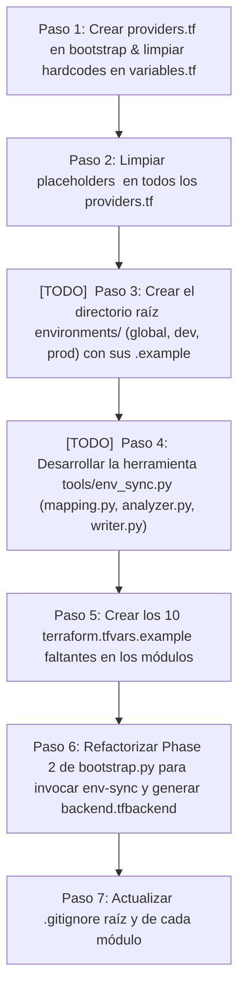

# Plan Maestro: Refactorización de Infraestructura Terraform & Herramienta `env-sync`

> **Estado del Plan:** Aprobado en sus componentes principales. Listo para iniciar implementación paso a paso.

---

## 🟢 PARTE 1: LO QUE YA ESTÁ 100% APROBADO Y ACORDADO

El usuario ha revisado y aprobado las siguientes estrategias técnicas:

### 1. Estrategia del Bucket de Estado Remoto (Partial Backend Configuration)
- **Decisión:** Se elimina el *find & replace* sobre archivos `.tf` (`phase_02_find_replace.py`).
- **Implementación:**
  - Los archivos `providers.tf` mantienen el bloque `backend "s3"` sin el atributo `bucket`.
  - Se genera un archivo `backend.tfbackend` con el bucket generado por el phase 1  (ej. `bucket = "cleanmybelly-tfstate-v1-..."`) en cada módulo.
  - El archivo `backend.tfbackend` está incluido en el `.gitignore` de cada módulo (cero diffs sucios en Git).
  - La invocación en Terraform utiliza: `terraform init -backend-config=backend.tfbackend`.

### 2. Creación de `providers.tf` en Bootstrap y Limpieza de Hardcodes
- Mover los bloques `terraform {}` y `provider {}` de `aws/pre-infra/bootstrap/main.tf` a su nuevo archivo dedicado `aws/pre-infra/bootstrap/providers.tf`.
- Limpiar valores personales y de prueba hardcodeados en los `variables.tf`:
  - `github/repository/variables.tf`: Eliminar defaults `"JoseLopezLara"` y `"Test2"`. Corregir descripción `"Test2 name"`.
  - `github/secrets-workflow/variables.tf`: Eliminar default `"JoseLopezLara"`.

### 3. Creación de `terraform.tfvars.example` en todos los Módulos
- Crear archivos `terraform.tfvars.example` documentados en los 10 root modules que carecen de él.
- Asegurar que `.gitignore` ignore todos los archivos `terraform.tfvars` reales project-wide.


### 4. Gestión del `TERRAFORM_STATE_BUCKET` (Modelo Híbrido)
- **First Run (`bootstrap.py`):** La Fase 1 crea el bucket S3 en AWS y la Fase 2 escribe automáticamente `TERRAFORM_STATE_BUCKET=cleanmybelly-tfstate-v1-...` en `environments/global/.env.shared` y ejecuta `env-sync` para inyectar los `backend.tfbackend`. Cero trabajo manual en el primer despliegue.
- **Uso Manual / Re-sync:** El usuario o un compañero de equipo puede modificar `TERRAFORM_STATE_BUCKET` libremente en `.env.shared` y ejecutar `python3 tools/env_sync.py` para conectar sus módulos locales a un estado remoto existente.

---

## 🟡 PARTE 2: PROPUESTA DE SOLUCIÓN PARA LA IMPLEMENTACIÓN

A continuación se detalla la propuesta técnica paso a paso para construir la solución:



### [TODO] Especificación de `tools/env_sync.py`:

```text
tools/
├── env_sync.py                        # Entrypoint CLI: python3 tools/env_sync.py
└── modules/
    └── env_sync/
        ├── __init__.py
        ├── mapping.py                 # Dict ENV_GLOBAL_MAP, ENV_DEV_MAP, ENV_PROD_MAP
        ├── analyzer.py                # Analizador AST/regex de variables.tf y diffs
        ├── writer.py                  # Generador de tfvars y backend.tfbackend
        └── validator.py              # Validador de consistencia .example vs .env
```

---

## PARTE 3: Aún no definido y ultimo enfoque (Propuesta) obtenida pero que aún se requiere trabajar mas para tomar la desición final.

El usuario ha revisado y aprobado las siguientes estrategias técnicas:


### 1. [TODO] Estructura de Entornos bajo `environments/` (Raíz del Proyecto)
Se adopta la organización de archivos de entorno por capas dentro del directorio `environments/`:

```text
cleanmybelly/
├── environments/
│   ├── global/
│   │   ├── .env.bootstrap.example  ──(cp)──>  .env.bootstrap  (Fase 0: GitHub PAT, OIDC, Repo Name)
│   │   └── .env.shared.example     ──(cp)──>  .env.shared     (Networking: Región, Dominio, Remote State Bucket)
│   ├── dev/
│   │   └── .env.dev.example        ──(cp)──>  .env.dev        (Infra Dev: Tabla Dynamo, Lambda, Frontend)
│   └── prod/
│       └── .env.prod.example       ──(cp)──>  .env.prod       (Infra Prod: Tabla Dynamo, Lambda, Frontend)
```

### 2. [TODO] Diseño de la Herramienta `tools/env_sync.py` (Modelo Híbrido)
- **Mapeo Declarativo (`mapping.py`):** Para variables compartidas/globales (`PROJECT_NAME`, `AWS_REGION`, `HOSTED_ZONE_NAME`, `TERRAFORM_STATE_BUCKET`). Permite escribir la variable **una sola vez** en el `.env` y propagarla a múltiples módulos (Fan-out) traduciendo exactamente el nombre (`tf_var`) exigido por cada HCL.
- **Auto-descubrimiento:** La herramienta lee los `variables.tf` para validar los contratos de variables.
- **Traducción de Nombres:** Mapea la convención `.env` (`SNAKE_CASE_UPPER`) a Terraform (`snake_case`).

---

## ❓ [TODO] PARTE 4: PREGUNTAS Y DECISIONES PENDIENTES DE CONFIRMACIÓN

Para iniciar la sesión en la nueva ventana de chat, estas son las preguntas/puntos que podemos confirmar con el usuario antes o durante el desarrollo:

1. **Detalle de Autodeclaración en `variables.tf` (Opcional):**
   - Cuando agregas una variable completamente nueva en un `.env` (ej. `DEV_BACKEND_NUEVO_SECRET="val"`), ¿prefieres que `env-sync` te alerte para que tú mismo agregues la declaración en `variables.tf`, o que `env-sync` agregue automáticamente `variable "nuevo_secret" {}` en el `variables.tf` si no existe?

    Respuesta: Quiero que se agregue en automatico per mas bien aquí quiero comenzar a dialogar sobre todos los pendientes que tenemos respecto a la parte 2 y parte 3.