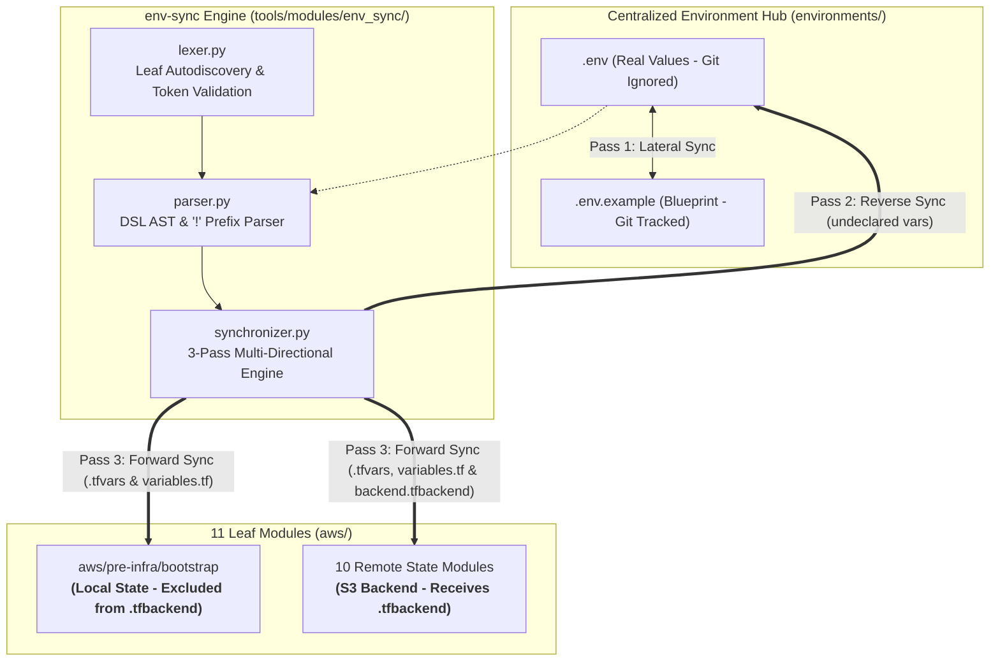

# Master Refactor Plan: Backend State Decoupling & Synchronization Architecture

## Part 1: APPROVED & READY FOR EXECUTION

### 1.1 Architectural Decisions Approved
1. **Terraform Partial Backend Configuration**:
   - `providers.tf` files define static backend attributes (`key`, `region`, `use_lockfile = true`) with NO bucket parameter.
   - Dynamic bucket parameter is injected at runtime via `backend.tfbackend` with `-backend-config=backend.tfbackend`.
2. **DSL `!` Prefix Separation**:
   - Variables prefixed with `!` in `.env` are routed exclusively to `backend.tfbackend` / `backend.tfbackend.example`.
   - Variables without `!` are routed to `variables.tf` and `terraform.tfvars` / `terraform.tfvars.example`.
3. **Attribute Translation (`!terraform_state_bucket` -> `bucket`)**:
   - HashiCorp Terraform S3 backend strictly requires `bucket = "..."`.
   - `env-sync` translates `.env` directives (`!terraform_state_bucket = "val"` or `!bucket = "val"`) into `bucket = "val"` inside `backend.tfbackend`.
4. **Local State Exception for `bootstrap`**:
   - `aws/pre-infra/bootstrap` provisions the remote state bucket and operates under local state.
   - `env-sync` dynamically inspects `providers.tf` (`has_s3_backend()`) and excludes `bootstrap` from receiving `backend.tfbackend`.
5. **Multi-Directional & Lateral Synchronization**:
   - Pass 1: Lateral Sync between `.env` and `.env.example`.
   - Pass 2: Reverse Sync from leaf modules (`variables.tf`) to `.env` and `.env.example`.
   - Pass 3: Forward Sync from `.env` to `variables.tf`, `.tfvars`, `.example`, `.tfbackend`.

---

## Part 2: PROPOSED IMPLEMENTATION PLAN & ARCHITECTURE

### 2.1 File Version Control Matrix

| File Type | Git Status | Generator / Modifier | Content Description |
| :--- | :--- | :--- | :--- |
| `environments/**/.env.*` | ❌ Ignored | Developer / Phase 2 CLI | Real environment values and `!terraform_state_bucket` |
| `environments/**/.example` | ✅ Tracked | `env-sync` (Lateral Sync) | Template blueprints with empty values (`""`) |
| `aws/**/variables.tf` | ✅ Tracked | `env-sync` (Auto-declaration) | HCL variable definitions |
| `aws/**/terraform.tfvars` | ❌ Ignored | `env-sync` (Forward Sync) | Active local input variables |
| `aws/**/terraform.tfvars.example` | ✅ Tracked | `env-sync` (Forward Sync) | Template input variable blueprints |
| `aws/**/backend.tfbackend` | ❌ Ignored | `env-sync` (Forward Sync) | Active `bucket = "..."` parameter for remote state modules |
| `aws/**/backend.tfbackend.example` | ✅ Tracked | `env-sync` (Forward Sync) | Template `bucket = ""` for remote state modules |

---

## Part 3: OPEN QUESTIONS & DECISIONS

All core decisions regarding the remote backend state behavior, `!` syntax, `bucket` translation, and multi-directional synchronization have been implemented, tested, and validated.

* **Current Status**: Complete & 100% Validated (`python3 tools/env_sync.py --validate` exits with code 0).
* **Next Steps for Next Session**: The codebase is ready for subsequent infrastructure deployment, feature additions, or pipeline configurations.
